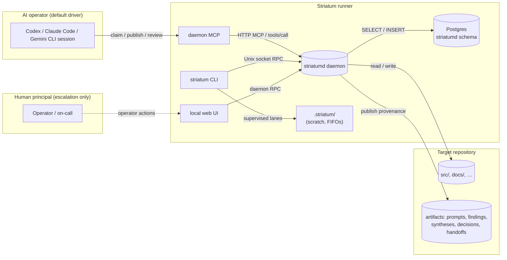
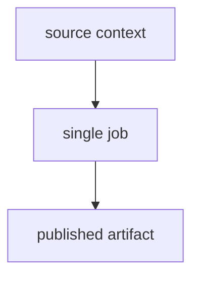
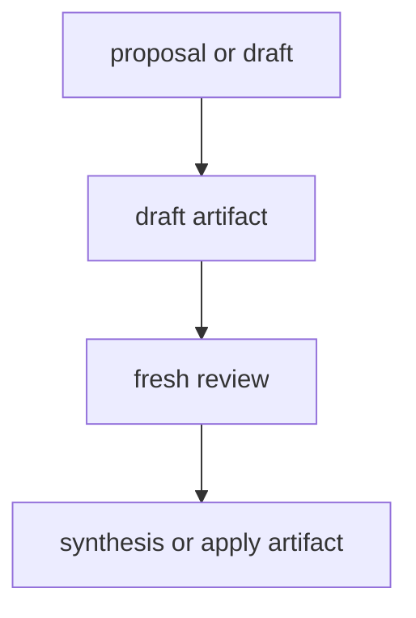
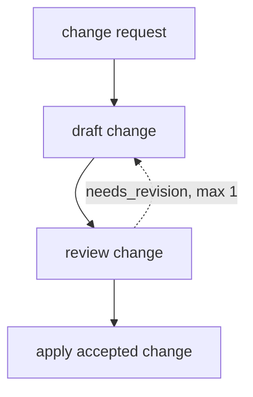
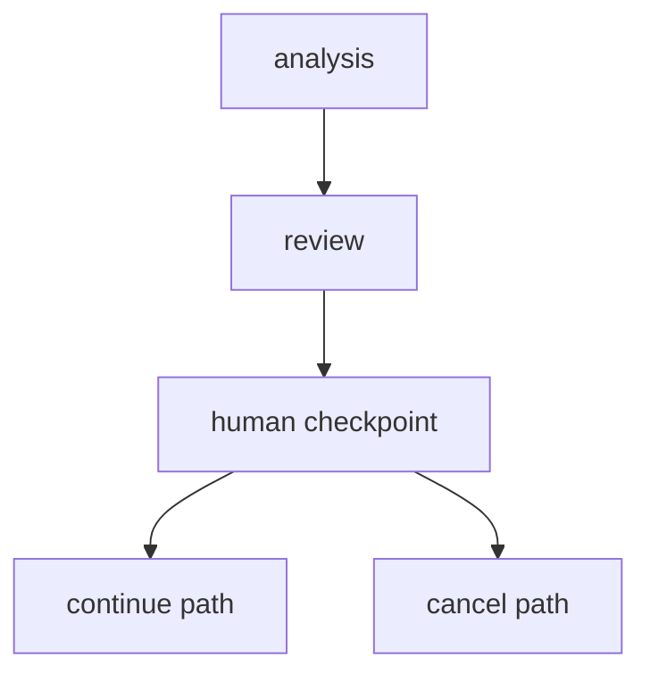
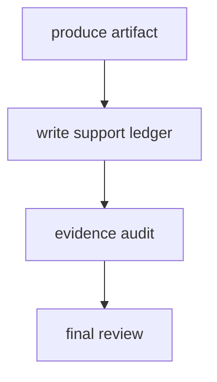
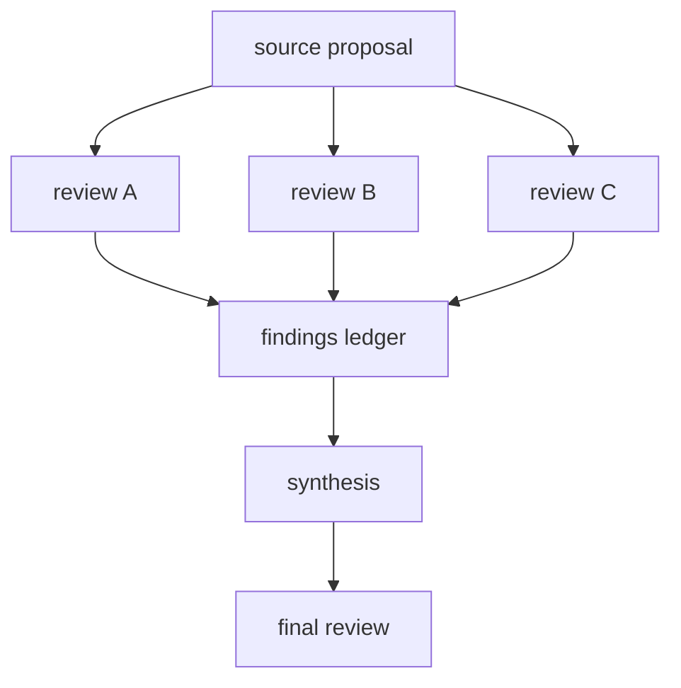

# striatum

> A local workflow runner for terminal-based AI coding agents.

AI coding agents are powerful in isolation and surprisingly fragile in combination. Without a coordinator, two agents reviewing the same draft will agree with each other whether the work is good or not. Without provenance, a crashed session leaves no reliable record of what it touched. Without explicit workflow structure, recovery means poking at files and guessing.

Striatum is the coordinator that was missing. It gives your AI agents — Codex, Claude Code, Gemini CLI, or anything that runs in a terminal — a structured multi-lane workflow with leases, verdicts, audit chains, and durable repo artifacts. No hosted service. No telemetry. No vendor SDK inside the runner.

---

## What Striatum Does

- **Coordinates multi-agent work** across parallel implement → review → repair → synthesize loops, with deterministic state tracked in a local daemon-owned Postgres database
- **Eliminates reviewer co-blindness** by making lane assignment first-class: a `codex` implementer can be reviewed by `claude` and synthesized by `gemini`; a `needs_revision` verdict is recorded, not papered over
- **Chains every event** with a SHA-256 anchor linked to its predecessor — per-repository for events, daemon-global for the RPC audit log; `striatum doctor` verifies both chains
- **Keeps providers portable** by wrapping any model whose runtime is a terminal command; core scheduling never imports a model vendor or parses terminal output
- **Produces replayable evidence** via `corpus export`: a redacted JSONL bundle with stable hashes for sharing provenance without sharing live state

The authoritative mutation surface is daemon MCP/RPC. AI agents use daemon MCP
for live workflow control, humans use the local web UI for routine operator
actions, and the CLI remains a daemon-backed bootstrap, diagnostics, and
compatibility client.

---

## At a Glance



The daemon owns live state. The target repository owns durable provenance.
`.striatum/` next to each target repo is operational scratch (supervised
wrapper FIFOs, pidfiles, and transient supervisor scratch). The daemon runtime
token lives under the daemon runtime directory as `client-token`.

---

## Architecture

```
┌────────────────────────────────────────────────────────────────┐
│          AI operator  ·  human principal  ·  web UI            │
│      (Codex / Claude Code / Gemini CLI / browser)              │
├────────────────────────────────────────────────────────────────┤
│      daemon MCP  ·  local web UI  ·  striatum CLI fallback     │
│        capability-gated clients of the daemon RPC boundary      │
├────────────────────────────────────────────────────────────────┤
│                 Daemon RPC envelope (v1)                        │
│     capability checks · audit-chain append · method registry   │
├────────────────────────────────────────────────────────────────┤
│                   Go daemon/RPC handlers                       │
│         runs · sessions · jobs · leases · verdicts             │
│         artifacts · blockers · events · audit_log              │
├────────────────────────────────────────────────────────────────┤
│       Postgres striatumd schema (runtime schema 47 / owner 0023)│
│    append-only events + artifacts  ·  hash-chained audit rows  │
│    serialized audit head  ·  per-repo event chain heads        │
└────────────────────────────────────────────────────────────────┘
                           ▲
              target repo: durable Markdown artifacts
              .striatum/: operational scratch (never live state)
```

Every state transition is a short serializable Postgres transaction that emits a structured event. Events and artifact records are append-only — `UPDATE`/`DELETE` are revoked from the daemon read-write role. The hash chain serializes concurrent appenders on the chain-head row so forks are impossible.

---

## Workflow Shapes

Striatum does not pick a default workflow. Every run starts from an explicit `workflow.json` you choose or generate. These are the canonical shapes — pick the one that matches your desired outcome.

### Minimal bounded job

One scoped task, one artifact, no review gate. Good for generating a small report, producing a migration note, or creating a first draft that will be reviewed outside Striatum.



```bash
striatum workflow generate --shape minimal --workflow-id my-task --scaffold-root workflows/my-task --write
```

### Review and synthesis

The safest first-contact shape. Exercises the core runner model without asking an agent to touch broad source areas. Good for RFC review, product proposals, TODO-to-plan conversion, and documentation review.



```bash
striatum workflow generate --shape review --workflow-id my-review --scaffold-root workflows/my-review --write
```

### Code change with bounded revision

Make a repository change and give the reviewer one explicit route to send it back. Good for small code changes, doc fixes, and focused bug fixes.



```bash
striatum workflow generate --shape code_change --workflow-id my-change --scaffold-root workflows/my-change --write
```

### Human checkpoint

Stop and wait for an owner decision before proceeding. The pause is explicit live state, not a comment in an artifact. Good for accept/reject decisions, choosing between designs, or approving a risky write scope.



Start from `examples/human-checkpoint-flow/`.

### Evidence-backed artifact

Output that makes claims auditable from curated evidence, not from a hidden transcript. Good for support-heavy technical recommendations, decisions that cite file paths or commands, and claims another reviewer must verify independently.



Start from `examples/support-ledger-flow/`.

### Multi-review synthesis

Disagreement across reviewers is the point. Parallel independent reviews feed a findings ledger or synthesis job; a final review checks the combined recommendation. Good for RFCs, architecture decisions, adversarial posture coverage, and high-risk implementation plans.



Start from `examples/rfc-ledger-cleanup/`.

---

## The Two Roles

Striatum runs with two named roles (RFC 0053):

- **AI operator** — the default driver. Claims work, publishes artifacts, and advances state through daemon MCP tools. CLI verbs are compatibility/debug fallbacks, not the normal live control plane.
- **Human principal** — escalation only. Resolves blockers the AI judges itself stuck on (`escalation` artifacts). Routine work belongs to the operator.

The [day-zero usage guide](docs/tutorials/using-striatum.md) walks new arrivals through both roles, prerequisites, first run, and the principal's escalation surface.

---

## Why Striatum

**Reviewer co-blindness.** If the same model both implements and reviews, it will accept work the operator wouldn't. Striatum makes lane assignment first-class (RFC 0018) so a `codex` implementer can be reviewed by `claude` and synthesized by `gemini`, and a verdict reaching `needs_revision` is recorded — not papered over. The dogfood ledger under `docs/dogfood/` shows where this caught real divergence between drafts.

**Audit-quality provenance.** Many workflows lose state when a session crashes, a process exits nonzero, or a serve restarts. Striatum's authoritative live state is the daemon-owned Postgres; every event carries a `previous_hash` / `row_hash` anchor (added in migration 0006); every RPC request lands a row in `striatumd.audit_log` with a chain head locked `FOR UPDATE` so concurrent appenders serialize. `corpus export` produces a verifying manifest with replay-stable SHA-256s.

**Provider portability.** The runner has no model dependency. Add a lane to a workflow JSON, install a skill bundle for that provider's harness, and the same daemon MCP method set works. The product boundary in [`docs/SPEC.md`](docs/reference/spec.md) explicitly forbids the runner from importing any vendor SDK.

---

## Quick Start

```bash
# One-line install: downloads the latest GitHub Release for your OS/arch,
# verifies SHA256SUMS, and installs striatum + striatumd +
# striatum-supervisor-helper into ~/.local/bin (see install.sh --help).
curl -fsSL https://raw.githubusercontent.com/halbritt/striatum/main/install.sh | sh

# Upgrading? A running striatumd keeps executing the OLD binary until you
# restart it (the installer reminds you):
#   systemctl --user restart striatumd

# Or manually: download and unpack a Go release archive for your OS/arch,
# then put its bin/ directory on PATH.
tar -xzf striatum_2.15.0_linux-amd64.tar.gz
export PATH="$PWD/striatum_2.15.0_linux-amd64/bin:$PATH"

# Render the daemon unit and config scaffold. Set postgres_url in
# ~/.config/striatum/daemon.toml, or export STRIATUM_DAEMON_DB_URL.
striatum daemon install --no-start

# Check/provision the daemon's Postgres substrate, then start the service.
striatum daemon migrate-db --json
systemctl --user start striatumd
striatum daemon status

# Register a target repo and install the operator skill bundle.
TARGET_REPO=/path/to/your/repo
striatum repo add "$TARGET_REPO" --init --json
striatum --repo "$TARGET_REPO" skills install --profile claude_code --json

# Drive a workflow. The operator AI does the rest.
WORKFLOW=examples/code-change-flow/workflow.json
striatum --repo "$TARGET_REPO" workflow validate "$WORKFLOW" --json
striatum --repo "$TARGET_REPO" run prepare --workflow "$WORKFLOW" --json
striatum --repo "$TARGET_REPO" run start --run-id <run_id> --json
striatum --repo "$TARGET_REPO" dashboard --run-id <run_id> --once
```

Architecture map: [`ARCHITECTURE.md`](ARCHITECTURE.md). Full walkthrough: [`docs/USING_STRIATUM.md`](docs/tutorials/using-striatum.md). AI-operator playbook: [`docs/HOW_TO_AGENT.md`](docs/how-to/how-to-agent.md). Human-principal escalation guide: [`docs/HOW_TO_HUMAN.md`](docs/how-to/how-to-human.md).

### Install the agent skill bundle

```bash
# Claude Code (recommended)
striatum skills install --profile claude_code

# Codex
striatum skills install --profile codex

# Agy
striatum skills install --profile agy

# All at once
striatum skills install --profile all
```

The skill bundle teaches a Striatum-aware agent how to drive the runner without reading the source repo. Generated files are version-stamped; `striatum doctor` flags outdated bundles and emits the exact `skills install` invocation to fix them.

#### Optional agent-side skills

Beyond the Striatum-authored bundle, the operator may install optional,
third-party agent skills (e.g., a divergent-ideation skill). These are **not
part of Striatum or its runtime** — they install agent-side and Striatum never
fetches, vendors, or calls them. The operator pack prompts about them on first
initiation and installs only what you confirm. The curated registry of such
skills lives in [`skills/optional/`](skills/optional/README.md).

### Use the local web UI

```bash
BASE_URL=$(sed 's#/mcp$##' "${XDG_RUNTIME_DIR}/striatum/mcp-http-endpoint")
TOKEN=$(cat "${XDG_RUNTIME_DIR}/striatum/client-token")
curl -H "Authorization: Bearer ${TOKEN}" "${BASE_URL}/v1/health"
```

The web service is mounted by `striatumd` on the daemon's loopback HTTP
listener; there is no separate `striatum serve` command. Set
`STRIATUM_DAEMON_WEB_ALLOW_MUTATIONS=1` on the daemon process before starting
it when local web mutations are intentionally allowed. For browser access
without pasting bearer headers, use the read-only tailnet identity listener:
start `striatumd` with `STRIATUM_DAEMON_WEB_TAILSCALE=1` and point
`tailscale serve --bg unix:${XDG_RUNTIME_DIR}/striatum/web-ui.sock` at the
owner-only socket.

---

## Project Status

| Area | Status |
|------|--------|
| Version | v2.39.0 — latest release published 2026-06-27; Go-only runtime, PostgreSQL daemon, runtime schema 46, RFC 0170 P0 observe-only culling substrate, RFC 0171 first build slice, RFC 0168 P0 design acceptance, session-bound operator bootstrap, owner-bundle 0022, and D270 cross-repo product-surface retirement are live. Current source adds integrated RFC 0168 P0 uid-lease runtime schema 47 and owner bundle 0023 (see [CHANGELOG.md](CHANGELOG.md)) |
| Platforms | Linux + macOS Go binaries · Postgres 14+ |
| Distribution | GitHub release archives with `SHA256SUMS` |
| License | Apache-2.0 |
| CI | Go tests, frontend checks, archive checks, and Go-only smoke scripts |
| Daemon substrate | Daemon-owned PostgreSQL is the live state substrate; repository files are durable provenance, not the message bus |
| Schema | Managed by Go runtime migrations and owner bundles; current source is `go/pkg/db/migrations.go` (runtime schema 47), `go/pkg/db/owner.go` (owner bundle 0023), and `docs/reference/spec.md`; latest published release v2.39.0 is runtime schema 46 / owner bundle 0022 |
| Go runtime | Production runtime and release archive path for `striatum`, `striatumd`, and `striatum-supervisor-helper` |
| Active work | Run `striatum operator bootstrap --markdown` for the live frontier; current state lives in `docs/operator/BRIEF.md`, `docs/operator/rfc-roadmap.md`, and the open GitHub issues |
| Corpus export / augmentation | Corpus Contract V2 core landed; optional reference-only augmentation stays local and Striatum runs with external memory absent |

---

## Install from Source

```bash
git clone https://github.com/halbritt/striatum.git
cd striatum
make install
~/.local/bin/striatum --help
```

Run tests:

```bash
make check
```

---

## Documentation

| File | When to read |
|---|---|
| [`docs/USING_STRIATUM.md`](docs/tutorials/using-striatum.md) | The day-zero usage guide — operator + principal in one pass |
| [`docs/HOW_TO_HUMAN.md`](docs/how-to/how-to-human.md) | Human-principal escalation playbook; retains manual operator reference for debugging and demos |
| [`docs/HOW_TO_AGENT.md`](docs/how-to/how-to-agent.md) | Long-form companion to the RFC 0015 agent skill bundle |
| [`docs/POSTGRES_TRANSITION.md`](docs/how-to/postgres-transition.md) | Operator runbook for the D094 / RFC 0043 PostgreSQL cutover, retired SQLite handling, and repo registration |
| [`docs/WORKFLOW_TYPES.md`](docs/reference/workflow-types.md) | Workflow shapes and lane sets; starters, examples, defaults |
| [`docs/WRITING_WORKFLOWS.md`](docs/how-to/writing-workflows.md) | How to author your own `workflow.json` |
| [`docs/CLI_REFERENCE.md`](docs/reference/cli-reference.md) | Flat list of every CLI verb and stable exit codes |
| [`docs/SPEC.md`](docs/reference/spec.md) | The implementation contract; source of truth when this page disagrees with the runner |
| [`docs/CONSUMER_REPO_LAYOUT.md`](docs/reference/consumer-repo-layout.md) | Recommended target-repo layout (RFC 0056) |
| [`docs/ROADMAP.md`](docs/reference/roadmap.md) | Operator kickoff doc: active runway, queue, blocked items |
| [`docs/INDEX.md`](docs/index.md) | Every doc in `docs/` with a one-line summary |
| [`docs/rfcs/README.md`](docs/rfcs/README.md) | Accepted and proposed RFCs (0001 → current) |
