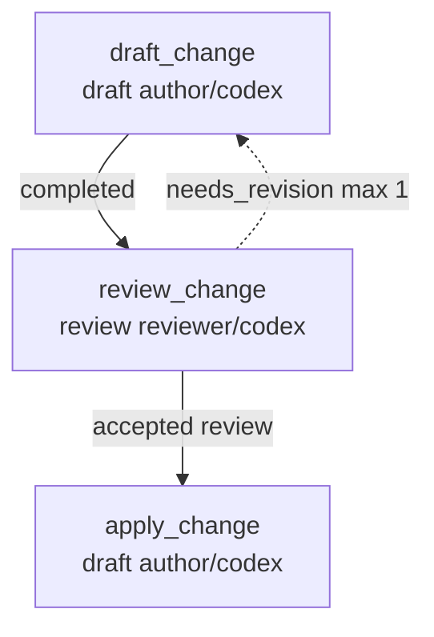

# Writing Workflows

This guide is for authoring a `workflow.json` and validating it
against the runner. The **canonical authoring path is `striatum
workflow generate`**; hand-editing and visual editing are alternate
paths for advanced cases.

For the AI-operator commands that consume a workflow, see
[how-to-agent.md](how-to-agent.md). For human-principal
escalations, see [how-to-human.md](how-to-human.md). For the workflow
families and graph shapes, see [workflow-types.md](../reference/workflow-types.md).

## The primary path: `striatum workflow generate`

```bash
striatum workflow templates list
striatum workflow generate \
  --shape code_change \
  --lane-set author_reviewer \
  --workflow-id my-change \
  --scaffold-root striatum/workflows/my-change \
  --artifact-root striatum/my-change \
  --json
```

Preview is the default. The preview envelope contains the generated
files and their paths without writing them. Add `--write` to create
`workflow.json`, role stubs, and prompt stubs under that workflow
tree. V1 refuses overwrites.

The generator does not currently accept lane-command bindings on the
CLI. For real agent lanes, generate the tree, edit the workflow's
`lanes` map to declare the command and `adapter_capabilities`, then
run `striatum workflow validate`.

`--shape` selects the graph family (`minimal`, `review`,
`code_change`, `human_checkpoint`, `evidence_backed`,
`implementation_panel`, `multi_review_synthesis`, `multi_phase`,
`custom`). `--lane-set` selects the lane topology (`local`,
`single_agent`, `author_reviewer`, `multi_review`, `custom`). They
compose independently, so the same graph shape can run on different
lane topologies.

For panel-style workflows, `--role-pack` selects the role vocabulary and
`--adversary-pack` selects the default scoring/review dimensions. The
current generated Phase B shape is `implementation_panel`; it emits
ordinary validated V1 workflow jobs and artifacts, not RFC 0052 typed
committee-deliberation artifacts.

```bash
striatum workflow generate \
  --shape implementation_panel \
  --lane-set multi_review \
  --workflow-id panel \
  --scaffold-root striatum/workflows/panel \
  --artifact-root striatum/panel \
  --option proposal_count=2 \
  --json
```

The generator is the path a team adopting striatum should reach for
first. The other surfaces below exist for cases where the generator's
closed vocabulary does not cover the workflow.

## Alternate paths (advanced)

### Generate a local starter

```bash
striatum workflow generate \
  --shape review \
  --lane-set local \
  --workflow-id new-flow \
  --scaffold-root path/to/new-flow \
  --write
```

Use this when you want a starter without binding real provider
lanes yet. The generated tree includes `workflow.json` plus `roles/`
and `prompts/` stubs and validates cleanly. The command refuses to
overwrite existing files.

### Start from an example fixture

For shapes the generator does not cover, start from a checked-in
example: `examples/rfc-ledger-cleanup/workflow.json`,
`examples/docs-review-flow/`, `examples/code-change-flow/`,
`examples/failed-review-revision-cycle/`,
`examples/human-checkpoint-flow/`, or
`examples/adapter-unavailable-flow/`. Copy, edit, then run
`striatum workflow validate <path> --json` to check the result.

### Visual editing

The RFC 0038 React Flow editor at `/workflows/edit/<path>` is retired in the
current Go-only web UI. There is no current browser graph editor for workflow
files. Use the generator for new workflows, hand-edit the JSON when needed, and
run `striatum workflow validate <path> --json` after each edit.

## Required top-level fields

`schema_version`, `workflow_id`, `workflow_version`, `name`,
`branch`, `coordinator`, `lanes`, `roles`, `context_docs`,
`parallelism`, `jobs`, `edges`, `cycles`.

`schema_version` is `striatum.workflow.v1` for V1 workflows.

## Common job fields

`id`, `type`, `title`, `role_id`, optional `lane_id`, `objective`,
`task_prompt`, `inputs`, `write_scope` (`allowed_paths`,
`forbidden_paths`), `expected_artifacts` (`logical_name`, `kind`,
`path`, `required`), `fresh_session_required`, and
`parallel_group`. Jobs that mutate a shared external fixture such as a
test database may also declare `shared_resources`.

## Choose lanes deliberately

Workflow type chooses the graph; lane selection chooses the execution
surface. A lane is a named adapter configuration, not a provider
identity. The runner does not infer that a lane named `codex` or
`reviewer` has any special behavior; behavior comes from the lane's
adapter, command, constraints, capabilities, and optional harness
profile.

For real runs, prefer explicit `lane_id` values on jobs. If a job
omits `lane_id`, the queued work is not lane-constrained and any
matching role session may claim it. That can be useful for manual
operation, but it makes later audit and repeatability weaker.

Common lane sets:

- **single-lane starter**: one lane handles authoring, review, and
  synthesis. Good for small or operator-by-hand runs.
- **author plus reviewer**: author jobs and review jobs bind to
  separate lanes, usually with `fresh_session_required: true` on the
  review jobs.
- **multi-review fan-out**: several review jobs bind to distinct
  lanes, often different model families, and converge into a ledger or
  synthesis job.
- **supervised lane**: a process-adapter lane driven by
  `striatum supervise`; by default, use a command or wrapper that can
  read newline-delimited work packets from a persistent stdin FIFO.
  For single-prompt commands that require stdin EOF before doing work,
  set `supervision.stdin_delivery: "one_shot_eof"`.
- **worktree-isolated lane**: a repo-write lane with
  `worktree_isolation: "per_job"` when autonomous or parallel writes
  need isolated git worktrees. Supervised or agent-loop repo-write lanes
  are refused without it unless the lane records
  `allow_shared_checkout_repo_write: true` and a non-empty
  `shared_checkout_repo_write_rationale` for an explicit
  interactive-human compatibility workflow.
- **shared external fixtures**: jobs in a `parallel_group` that use the same
  mutable database, device, or fixture should declare `shared_resources`. Use
  string entries for exclusive resources, or object entries with
  `mode: "per_lane_namespace"` and a distinct `namespace` when the workflow
  provisions separate fixtures. `workflow validate --json` reports a warning
  when parallel jobs share an exclusive resource or reuse a namespace, and work packets surface the
  hazard under `context.shared_resources`.
- **constrained lane**: a lane with `constraints` and
  `required_enforcement` when network, transcript, or repo-scope policy
  should be visible and validation-checked.

Minimal process lane:

```json
{
  "lanes": {
    "agent": {
      "adapter": "process",
      "display_model": "Your Agent Model",
      "command": ["your-agent-cli", "run-from-stdin"],
      "capabilities": ["write", "review", "synthesis"]
    }
  }
}
```

Replace the placeholder command with the actual invocation shape your
agent CLI expects.

For the operator-facing lane selection matrix, see
[WORKFLOW_TYPES.md § "Lane Selection Heuristic"](../reference/workflow-types.md#lane-selection-heuristic).

## Adapter constraints

Lane configs may declare adapter constraints:

```json
{
  "constraints": {
    "network": "forbidden",
    "transcripts": "off",
    "repo_scope": "local_only"
  },
  "required_enforcement": {
    "network": "advisory_strict",
    "transcripts": "enforced"
  }
}
```

V1 records the requested constraint, the required enforcement
level, the adapter's actual enforcement (`enforced`,
`advisory_strict`, `advisory`, or `unsupported`), and satisfaction
status in work packets. Validation rejects a lane when
`required_enforcement` asks for a level the adapter cannot
provide. The local process adapter enforces transcript-off,
scrubs proxy env vars when network is forbidden, and sets
`STRIATUM_NETWORK_POLICY` and `STRIATUM_REPO_SCOPE` sentinels so
cooperating agents can honor the policy.

## Shape a custom run scaffold

A striatum run starts from a concrete design proposal, not from a
project type. The proposal can be an RFC, TODO, bug report,
feature request, review finding, support note, or any other local
artifact that describes the desired change or decision. Keep that
source artifact in the target repository and reference it from
`context_docs` or the relevant job `inputs`.

Before editing `workflow.json`, choose the run outcome. For the
full selection guide and diagrams, see
[WORKFLOW_TYPES.md](../reference/workflow-types.md). The short version:

- **review only**: independent reviewers inspect the source
  proposal, publish findings, and a synthesis job produces the
  durable recommendation.
- **produce a spec**: reviewers or researchers feed a
  spec-authoring job, then a review gate checks the generated
  spec before the run ends.
- **produce a spec and implement**: the spec path continues into
  implementation, build or test verification, and final review.
- **repair implementation**: a bug report, failing review, or
  smoke-test finding feeds an implementation job and a focused
  verification job.
- **human checkpoint**: the runner records a required owner
  decision before later jobs become claimable.

Use `workflow generate --shape review` for proposal review, RFC
cleanup, bug triage, feature request analysis, and TODO
conversion. Use `--shape code_change` when the same scaffold
should also drive repository edits. Use `--shape minimal` for a
single bounded job or when you want to build the graph from scratch.

`shape: "custom"` is not raw workflow JSON. It accepts a
`striatum.workflow_plan.v1` plan with closed block kinds:
`draft`, `review`, `synthesis`, `implementation`, `test`,
`human_checkpoint`, `support_ledger`, `evidence_audit`, and
`final_review`. Base edges must be acyclic; loops are declared only
through bounded `cycles`; every custom block must have a lane binding.

## Scaffold layout

Choose a repo-relative scaffold root such as `workflows/<slug>/`
or `docs/workflows/<slug>/` in the target repository. A reusable
scaffold usually contains:

```text
<scaffold-root>/workflow.json
<scaffold-root>/RUNBOOK.md
<scaffold-root>/SOURCES.md
<scaffold-root>/roles/*.md
<scaffold-root>/prompts/*.md
```

`workflow.json` is the executable contract. `RUNBOOK.md` is for
the AI operator, `SOURCES.md` records the local proposal and
context artifacts, and role or prompt files hold reusable task
wording. Workflow outputs should land in durable repo paths.
Keep runner state in `.striatum/`; do not publish transcripts as
workflow artifacts.

## Recommended output layout

striatum has no built-in output directory. The location of every
artifact is whatever your workflow's `expected_artifacts[].path`
and `write_scope.allowed_paths` say. If you don't have a strong
project-specific opinion about where the runner's output should
land, the recommended convention is:

```text
<your-repo>/
├── .striatum/                 # gitignored; operational scratch
└── striatum/                  # committed; durable workflow output
    └── <workflow-slug>/
        ├── RUN_SUMMARY.md
        ├── RUN_EVIDENCE.md
        ├── <draft>.md
        ├── <reviewer>/
        │   └── <review>.md
        └── final/
            └── <final-review>.md
```

The pair `.striatum/` (scratch, gitignored) and `striatum/`
(provenance, committed) is a clean visual reminder of the
distinction the runner makes between daemon-owned live state and
durable artifacts. It also makes "remove all striatum output" a
single `rm -rf striatum/` for first-contact users who want to try
the runner without scattering files across `docs/`.

If your project already has an artifact convention (`docs/reviews/`,
`docs/specs/`, `docs/decisions/`, `evidence/`, etc.), use it.
The runner does not care; it accepts every path the workflow
declares.

In `workflow.json` this looks like:

```json
{
  "id": "draft_change",
  "type": "build",
  "write_scope": {
    "mode": "repo_write",
    "allowed_paths": ["striatum/<workflow-slug>/"],
    "forbidden_paths": [".striatum/"]
  },
  "expected_artifacts": [
    {
      "logical_name": "draft",
      "kind": "handoff",
      "path": "striatum/<workflow-slug>/DRAFT.md",
      "required": true
    }
  ]
}
```

`evidence export` and `run summary` are operator commands; you
pass their `--path` on the command line. They have to be inside
the repo and outside `.striatum/`, but otherwise the runner does
not enforce a layout. Putting them under
`striatum/<workflow-slug>/` keeps the convention consistent.
Keep the coordinator/operator lane content-neutral when possible. If the
coordinator uses the same model family as a synthesis, phase-synthesis,
collaboration adjudicator, or final-review content gate, `workflow lint`
emits `operator_content_role_model_overlap`; set
`operator_content_neutrality_override_rationale` only when the workflow
intentionally accepts that overlap.

## Common graph shapes

These are shorthand reminders. For the more complete selection
guide with Mermaid diagrams, see
[WORKFLOW_TYPES.md](../reference/workflow-types.md).

```text
review_a + review_b + review_c -> findings_ledger -> synthesis -> final_review
proposal_review -> spec_author -> spec_review
proposal_review -> spec_author -> spec_review -> implement -> build_review
bug_triage -> implement_fix -> smoke_test -> final_review
proposal_review -> synthesis -> human_checkpoint -> implement
```

## Reviewer policy fields

Give independent reviewers `review_only_artifact` write scopes
and `fresh_session_required: true`. Give authoring and
implementation jobs `repo_write` only for the files they are
expected to change. Parallel jobs should have disjoint output
paths, and every expected artifact should have a stable path
under the target repository and outside `.striatum/`.

For the full reviewer policy field set
(`reviewer_access_scope`, `reviewer_context_policy`), see
[SPEC.md § Reviewer Policy](../reference/spec.md#reviewer-policy).

## Harness profiles (RFC 0010)

Workflows may declare an optional top-level `harness_profiles`
map and reference one profile per lane via `harness_profile_id`.
When set, the runner adds a `harness_profile` block to the lane's
work packets with the profile body verbatim plus a `profile_id`
key. Workflows that omit `harness_profiles` produce identical
packets to before — the field is fully additive.

The reference fixture lives at
`examples/harness-profiles/workflow.json`. The shipped supervised
wrappers live at
`.striatum/bin/{claude,codex,gemini}-supervised-wrapper.sh` (RFC
0010 V2, RFC 0063 follow-through). Workflows that declare supervised
Claude Code, Codex, or Gemini lanes can use the matching wrapper as
the lane command directly.

Process lanes can still run a simple push consumer over stdin, but current
AI-agent lanes should use the daemon-owned agent-loop PTY form. For Codex, use
a bare interactive command and declare the lane as an agent loop:

```json
"codex": {
  "adapter": "process",
  "display_model": "Codex",
  "command": ["codex", "--dangerously-bypass-approvals-and-sandbox", "--no-alt-screen"],
  "adapter_capabilities": {"agent_loop": true},
  "supervision": {"transport": "pty_helper"},
  "capabilities": ["write", "review"]
}
```

`workflow generate` fills those agent-loop and PTY-helper declarations for
direct Codex, Claude, and agy lane commands. Do not configure Codex as a
one-shot pipe lane with `codex exec` and
`supervision.stdin_delivery: "one_shot_eof"`; `workflow validate`, `run
prepare`, and `supervise start` refuse `codex exec` because it cannot run the
interactive work-packet loop and can stall before acking the delivered packet.

### `agy` lanes must be agent-loop lanes

`agy` (Antigravity) lanes must run as agent-loop lanes, declared with
`adapter_capabilities.agent_loop: true`:

```json
"agy": {
  "adapter": "process",
  "display_model": "Antigravity",
  "command": ["agy", "--sandbox"],
  "adapter_capabilities": {"agent_loop": true},
  "capabilities": ["write", "review"]
}
```

Do **not** configure `agy` as a one-shot pipe lane (`agy … --print` with
`supervision.stdin_delivery: "one_shot_eof"` or an `IFS= read -r prompt; …`
stdin shim). Supervised push lanes now receive one automatic claim/send at
`supervise start`, but the one-shot pipe path still lacks the agent-loop MCP
configuration and preserved interactive context that make `agy` autonomous.
The agent-loop submit driver landed in #51/#52 and is the viable autonomous
shape for agy. `workflow validate --json` reports an
`agy_one_shot_pipe_lane` warning when it detects a one-shot `agy --print`
lane that is missing `adapter_capabilities.agent_loop`. This agy-specific
warning is separate from the `claude --print` hard refusal below.
Agent-loop lanes use the PTY helper; when `tmux` is available they are
tmux-backed and operator-attachable by default, and status/doctor expose the
local diagnostic log under `trajectory_log`.
Do not copy unsafe flags across adapters: `workflow.lint` refuses
adapter-specific unsafe flags such as Claude's `--dangerously-skip-permissions`
or Codex's `--dangerously-bypass-approvals-and-sandbox` when they appear on an
`agy` lane.

### Retired one-shot lanes are refused

`claude --print` and `claude -p` are retired one-shot modes. `workflow
validate`, `run prepare`, and `supervise start` hard-refuse a lane whose
command invokes `claude` with `--print` or `-p`, because it cannot run the
agent-loop work-packet protocol and now risks billing API tokens per packet.
Use an interactive agent-loop lane instead:

```json
"claude_code": {
  "adapter": "process",
  "display_model": "Claude",
  "command": ["claude", "--dangerously-skip-permissions"],
  "adapter_capabilities": {"agent_loop": true},
  "capabilities": ["write", "review"]
}
```

For a deliberate compatibility fixture only, set `allow_claude_print: true` on
that lane. The override is explicit so live workflows do not accidentally
reintroduce the retired one-shot path.

`codex exec` is also retired and refused. It has no compatibility override;
use the interactive Codex agent-loop lane shown above.

For the full harness-profile schema (recognised tool families,
required fields, accountability rules), see
[SPEC.md § Harness Profiles](../reference/spec.md#harness-profiles).

## Validate before you ship

Before preparing a run, check the scaffold:

```bash
striatum --repo "$TARGET_REPO" workflow validate path/to/workflow.json --json
```

For repo-write work, do the scope pass before launch:

1. Read every prompt body and the job objective.
2. List the source and documentation paths the task is likely to touch.
3. Compare that list with each job's `write_scope.allowed_paths`.
4. Run `workflow validate --json` and resolve warnings before `run prepare`.

If a job changes daemon RPC routes, capabilities, method registry entries, or
the generated daemon method tables, include `contracts/` or
`contracts/daemon_methods.json` in that job's allowed paths. A workflow that
mentions daemon contract work but omits that scope is a launch-time footgun:
the lane can produce a valid draft while the daemon cannot durably seal the
contract file.

Review the validation output for warnings about lane commands, graph
structure, write scopes, required artifacts, and any principal escalations. Avoid
absolute home-directory paths in workflow fixtures; use
repo-relative paths and operator-local environment variables
instead.

## View a rendered graph

Offline workflow-file graphing was a Python-era authoring command and is not
part of the current Go CLI. Use `striatum run graph --run-id <id>` after
`run prepare` / `run start` when you need a state-annotated graph from live
daemon state.

For example, `examples/code-change-flow/workflow.json` has this static shape:



For state-annotated graphs of a *running* run, see
[how-to-human.md § "Dashboards and graphs"](how-to-human.md#dashboards-and-graphs).
