# Workflow Template Catalog

Generated from the bundled Striatum workflow template catalog.

## Workflow Shapes

### Adjudicated constraint extraction (`adjudicated_constraint_extraction`)

An eight-phase productive-refusal loop: cross-examiners challenge a candidate synthesis, the adjudicator converts load-bearing objections into binding constraints, revision discharges each one, and final review typechecks discharge.

- Recommended for: design and spec authoring; productive refusal; constraint-extracting multi-model panels
- Default lane sets: `multi_review`, `author_reviewer`, `local`
- Required options: `workflow_id`, `artifact_root`, `topic`
**Support tier:** `supported` — has a green RFC 0105 unattended-reliability fixture.

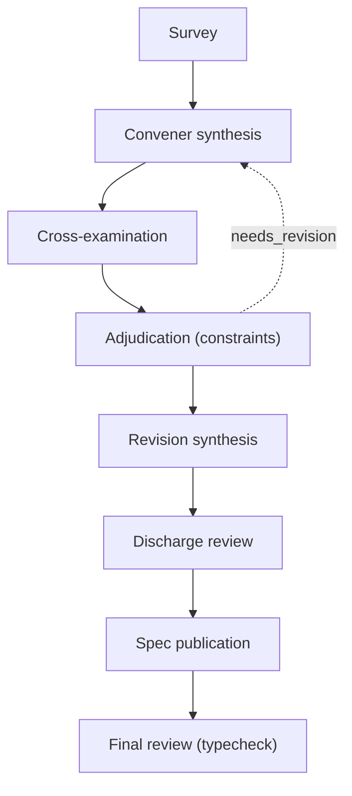

### Code change with bounded revision (`code_change`)

Draft, review, revise at most once if needed, then apply.

- Recommended for: small code or docs edits that need an explicit review gate
- Default lane sets: `author_reviewer`, `single_agent`
- Required options: `workflow_id`, `artifact_root`
**Support tier:** `supported` — has a green RFC 0105 unattended-reliability fixture.

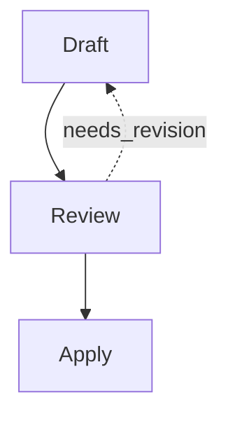

### Conversation (`conversation`)

N-turn, M-model alternating speaker conversation over the message bus.

- Recommended for: model-to-model dialogue; agent-operator interviews; multi-turn reasoning loops
- Default lane sets: `author_reviewer`, `multi_review`
- Required options: `workflow_id`, `artifact_root`, `topic`
**Support tier:** `experimental` — no unattended-reliability gate yet (RFC 0105); expect to supervise.

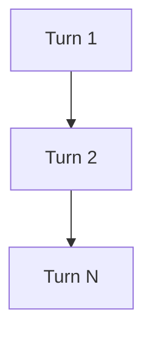

### Cross-examination gate (`cross_examination`)

Require falsifying cross-examination and a rebuttal record before a finding or proposal can publish downstream.

- Recommended for: finding readiness checks; proposal publication gates; challenge/rebuttal provenance
- Default lane sets: `multi_review`, `author_reviewer`, `local`
- Required options: `workflow_id`, `artifact_root`, `topic`
**Support tier:** `supported` — has a green RFC 0105 unattended-reliability fixture.

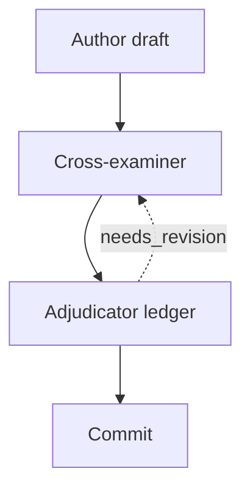

### Custom safe block plan (`custom`)

Compose a workflow from known block kinds without raw workflow JSON.

- Recommended for: advanced operators who need a graph not covered by a built-in shape
- Default lane sets: `custom`
- Required options: `plan`, `workflow_id`, `artifact_root`
**Support tier:** `experimental` — no unattended-reliability gate yet (RFC 0105); expect to supervise.

No fixed graph preview.

### Divergent ideation (`divergent_ideation`)

Widen a design space before narrowing it: diverge under cognitive frames (one per isolated branch), converge by scoring/clustering/trap-detecting, deepen the survivors, then synthesize. Frames are a curated, distortion-axis-tagged library (RFC 0129); branches round-robin across lanes for genuine multi-model divergence.

- Recommended for: architecture and API design choices; naming; fuzzy-bug hypothesis classes; migration strategy; give-me-a-few-different-ways prompts
- Default lane sets: `multi_review`, `author_reviewer`, `local`
- Required options: `workflow_id`, `artifact_root`
**Support tier:** `supported` — has a green RFC 0105 unattended-reliability fixture.

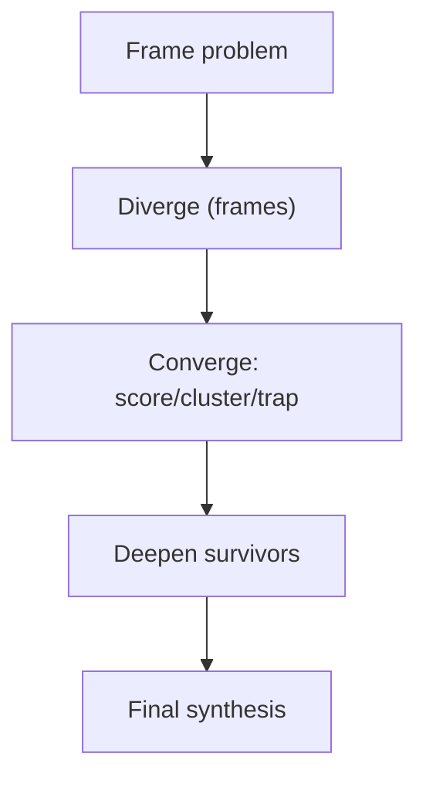

### Evidence-backed artifact (`evidence_backed`)

Produce claims with a support ledger and audit review.

- Recommended for: artifacts whose claims need explicit evidence checking
- Default lane sets: `author_reviewer`
- Required options: `workflow_id`, `artifact_root`
**Support tier:** `experimental` — no unattended-reliability gate yet (RFC 0105); expect to supervise.

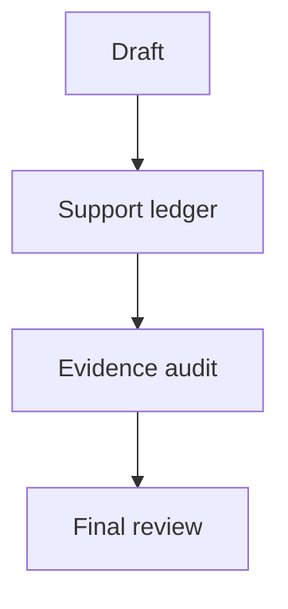

### Falsification gate (`falsification_gate`)

Challenge a published proposal with falsifier artifacts, then gate downstream work on an adjudicator's collaboration ledger.

- Recommended for: proposal readiness checks; assumption falsification; substance-gated static challenge/rebuttal
- Default lane sets: `multi_review`, `author_reviewer`, `local`
- Required options: `workflow_id`, `artifact_root`, `topic`
**Support tier:** `supported` — has a green RFC 0105 unattended-reliability fixture.

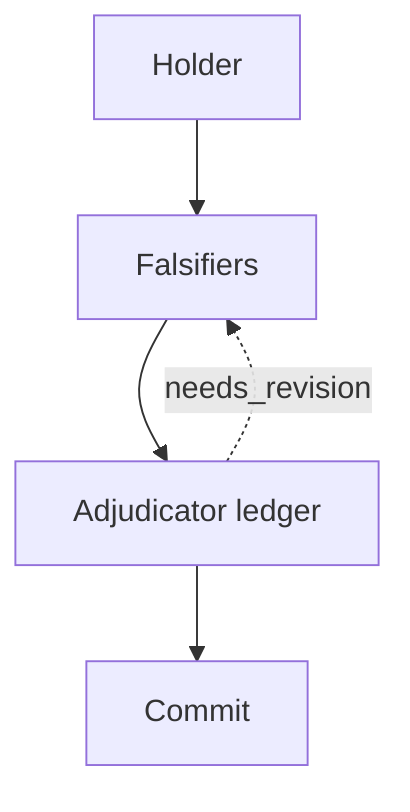

### Fog-of-war review (`fog_of_war_review`)

Distribute disjoint spec fragments to reconstructor lanes that interrogate peers to recover the hidden constraints, then withhold the proposal until a full-spec judge scores reconstruction coverage through the substance gate (RFC 0094 §2 work-packet type sequencing).

- Recommended for: partial-context reconstruction checks; constraint-coverage adjudication; deliberately-withheld-context design reviews
- Default lane sets: `multi_review`, `author_reviewer`, `local`
- Required options: `workflow_id`, `artifact_root`, `topic`
**Support tier:** `experimental` — no unattended-reliability gate yet (RFC 0105); expect to supervise.

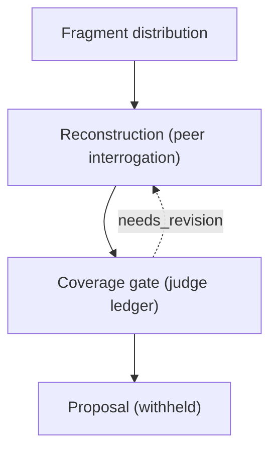

### Human checkpoint (`human_checkpoint`)

Require owner judgment before downstream work proceeds.

- Recommended for: runs that need an explicit operator decision gate
- Default lane sets: `author_reviewer`, `single_agent`
- Required options: `workflow_id`, `artifact_root`
**Support tier:** `experimental` — no unattended-reliability gate yet (RFC 0105); expect to supervise.

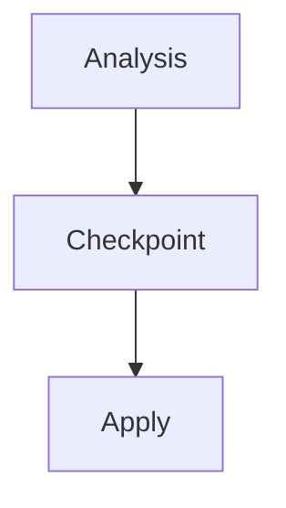

### Implementation panel (`implementation_panel`)

Compare several implementation approaches with explicit scorecards, arbitration, dissent, and a final decision.

- Recommended for: contested implementation choices; architecture trade-off resolution; high-risk design forks
- Default lane sets: `multi_review`, `author_reviewer`
- Required options: `workflow_id`, `artifact_root`
**Support tier:** `supported` — has a green RFC 0105 unattended-reliability fixture.

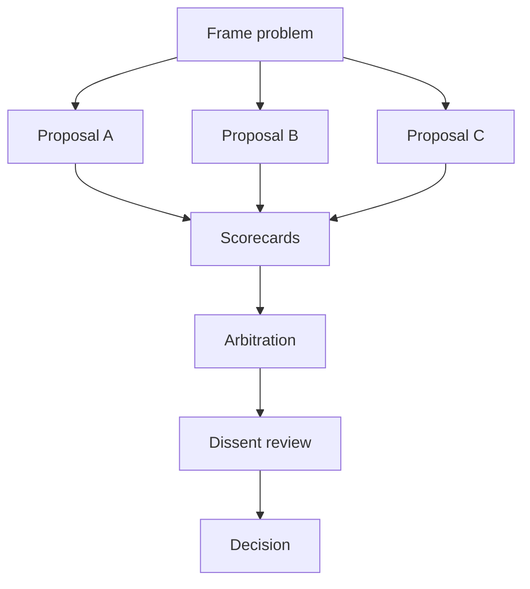

### Iterated interrogating panel (`iterated_interrogating_panel`)

Two chained design+build loops, each fanning out to three independent lanes, synthesizing, then an interrogating panel review with a bounded needs_revision cycle.

- Recommended for: high-stakes design-then-build work; patterns that need preserved-context interrogation; panel review with bounded re-work
- Default lane sets: `multi_review`, `author_reviewer`
- Required options: `workflow_id`, `artifact_root`
**Support tier:** `experimental` — no unattended-reliability gate yet (RFC 0105); expect to supervise.

**Example-only** — not a `workflow generate --shape` value. Copy and adapt the example workflow at `examples/iterated-interrogating-panel/workflow.json`.

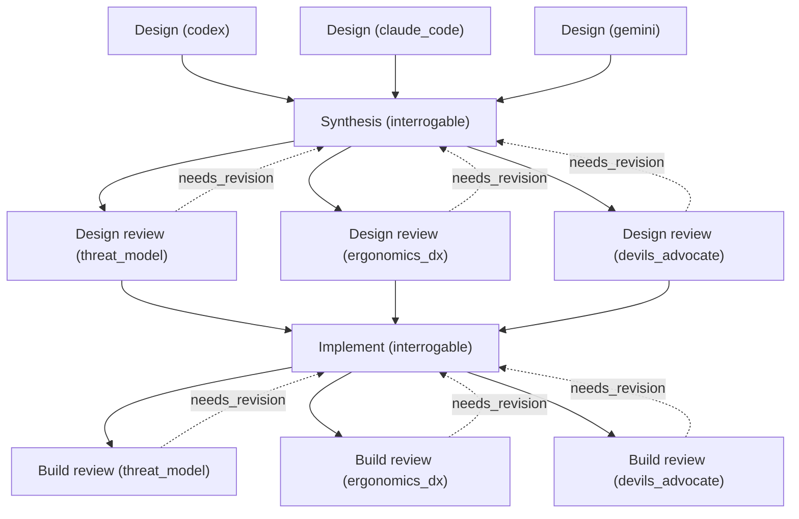

### Minimal bounded job (`minimal`)

One bounded job for a small report or starter artifact.

- Recommended for: small reports; narrow inspections; first drafts
- Default lane sets: `local`, `single_agent`
- Required options: `workflow_id`, `artifact_root`
**Support tier:** `supported` — has a green RFC 0105 unattended-reliability fixture.

### Multi-phase workflow (`multi_phase`)

Run phase-scoped parallel tracks behind explicit synthesis gates.

- Recommended for: large work split into ordered design, build, review, or release phases
- Default lane sets: `author_reviewer`, `multi_review`, `single_agent`
- Required options: `workflow_id`, `artifact_root`, `phases`
**Support tier:** `experimental` — no unattended-reliability gate yet (RFC 0105); expect to supervise.

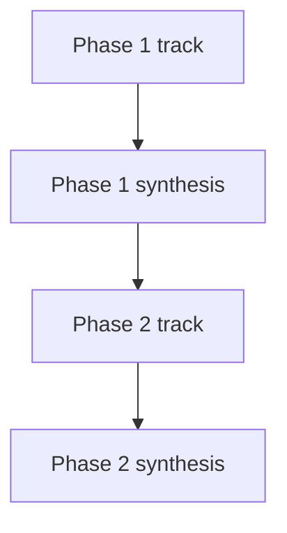

### Multi-review synthesis (`multi_review_synthesis`)

Collect several independent reviews before a final recommendation.

- Recommended for: productive disagreement; RFC or proposal review
- Default lane sets: `multi_review`
- Required options: `workflow_id`, `artifact_root`
**Support tier:** `supported` — has a green RFC 0105 unattended-reliability fixture.

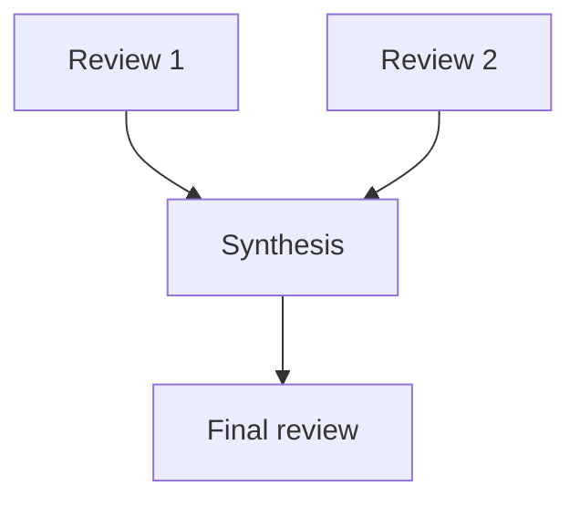

### Review and synthesis (`review`)

Draft, fresh review, then final synthesis.

- Recommended for: proposal review; bug triage; documentation review
- Default lane sets: `author_reviewer`, `single_agent`, `local`
- Required options: `workflow_id`, `artifact_root`
**Support tier:** `supported` — has a green RFC 0105 unattended-reliability fixture.

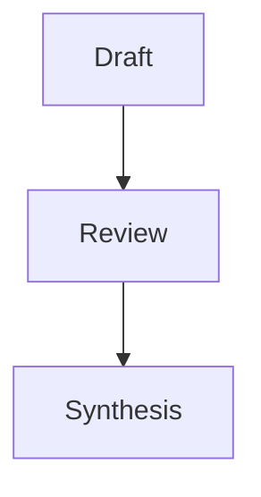

### Synaptic prune (`synaptic_prune`)

After a forum closes, a post_dialog_hook (RFC 0094 §1) emits a prune packet before the participant lanes' preserved-context window releases; each still-live participant nominates one claim to retire, and any claim with >=2 votes is recorded in a durable collaboration_ledger injected as a negative preamble into future runs on the same topic.

- Recommended for: retiring re-litigated claims; durable do-not-re-litigate records; post-forum consolidation
- Default lane sets: `multi_review`, `author_reviewer`, `local`
- Required options: `workflow_id`, `artifact_root`, `topic`
**Support tier:** `experimental` — no unattended-reliability gate yet (RFC 0105); expect to supervise.

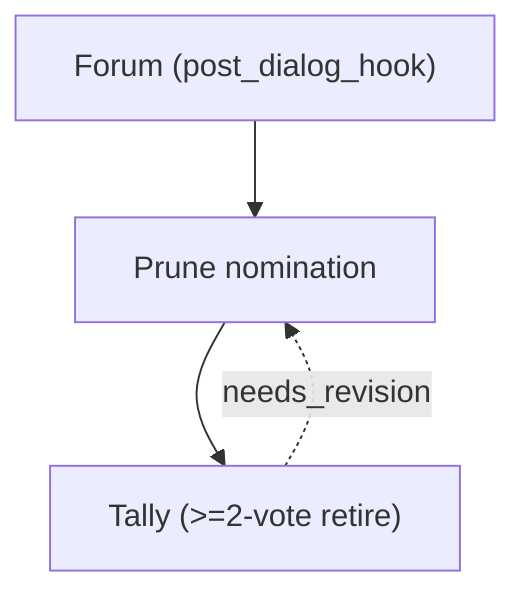

### Verification gate (`verification_gate`)

Make completion a CHECKED property, not a word a producer types. The builder ships a claim ledger; a real type:verify job runs `striatum verifier run` against sanctioned checks (builtin go-test/vet/build run with zero operator JSON, capped at ASSERTED) and mints receipts; the adjudicator gates the cleared release on the receipts. The sanctioned-check intent is in the verify lane's forbidden_paths (separation of duties), and VERIFIED is reserved for an external, operator-pinned-and-attested check (RFC 0141).

- Recommended for: gating a release on machine-checked claims; completion provenance; stopping ideation/doc stages from claiming features the build never delivered
- Default lane sets: `author_reviewer`, `multi_review`, `local`
- Required options: `workflow_id`, `artifact_root`
**Support tier:** `experimental` — no unattended-reliability gate yet (RFC 0105); expect to supervise.

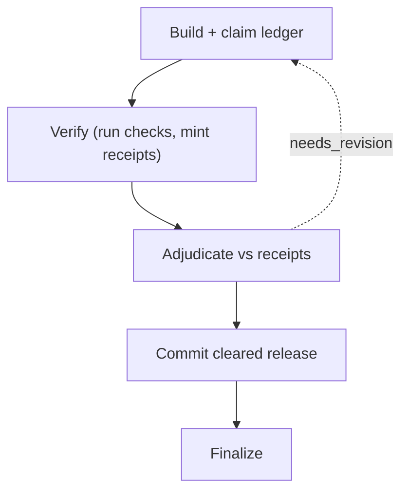

## Lane Sets

### Separate author and reviewer (`author_reviewer`)

Authoring jobs and review jobs bind to separate lanes.

- Recommended for: independent review for a code or docs change
- Required options: `lanes.author.command`, `lanes.reviewer.command`

### Custom lane bindings (`custom`)

Advanced lane topology with every binding declared.

- Recommended for: custom plans with explicit job-to-lane bindings
- Required options: `lanes`, `plan.job_lane_bindings`

### Local fixture lane (`local`)

Validation/scaffolding-only fixture lane set: its command sinks the packet (sh -c 'cat >/dev/null') and produces no artifact, so a run whose jobs declare expected_artifacts will park. Under RFC 0088 a claim requires an attached supervisor, so there is no human-types-the-artifact path -- use single_agent/author_reviewer/multi_review with real agent commands for runs that must produce artifacts.

- Recommended for: tests; validation; starter scaffolds

### Multiple reviewers (`multi_review`)

One author lane plus several reviewer lanes.

- Recommended for: productive disagreement through multiple review postures
- Required options: `lanes.author.command`

### Single agent (`single_agent`)

One real agent session handles the whole workflow.

- Recommended for: small low-risk work; early adoption
- Required options: `lanes.agent.command`

## Role Packs

### Implementation panel roles (`implementation_panel_roles`)

Independent proposal authors, a scorekeeper, an arbitrator, and a dissent reviewer for explicit trade-off resolution.

- Recommended for: implementation_panel; architecture_tournament
- Default shapes: `implementation_panel`
- Roles: `problem_framer`, `proposer_a`, `proposer_b`, `proposer_c`, `scorekeeper`, `tradeoff_ledger`, `arbitrator`, `dissent_reviewer`, `principal_decider`

### Incident response roles (`incident_response`)

Reproduction, root-cause, fix-planning, verification, and retrospective viewpoints for incident closure.

- Recommended for: incident follow-up; workflow failure analysis
- Default shapes: `review`, `evidence_backed`
- Roles: `reproducer`, `root_cause_analyst`, `fix_planner`, `verifier`, `retrospective_author`

### Release readiness roles (`release_readiness`)

Release, documentation, migration, smoke-test, and rollback viewpoints for shipping decisions.

- Recommended for: release readiness reviews; migration releases
- Default shapes: `review`, `multi_review_synthesis`
- Roles: `release_manager`, `docs_reviewer`, `migration_reviewer`, `smoke_verifier`, `rollback_reviewer`

## Adversary Packs

### Maintainer cost pressure (`maintainer_cost`)

Challenge approaches on long-term ownership, migration burden, and support cost.

- Recommended for: architecture choices; large refactors
- Default shapes: `implementation_panel`, `code_change`
- Postures: `maintainability`, `migration_risk`, `reversibility`

### Operator ergonomics pressure (`operator_ergonomics`)

Challenge approaches on setup clarity, repeated-use friction, recovery behavior, and local-first operation.

- Recommended for: operator tools; workflow catalog entries
- Default shapes: `implementation_panel`, `review`
- Postures: `operator_experience`, `recovery`, `documentation`

### Security and privacy pressure (`security_privacy`)

Challenge approaches on capability scope, data minimization, secret handling, and persistence boundaries.

- Recommended for: MCP surfaces; artifact export; daemon methods
- Default shapes: `review`, `evidence_backed`
- Postures: `security`, `privacy`, `capability_scope`
