# Workflow Types

Status: guide
Date: 2026-05-11

This guide answers the operator question that the JSON schema does
not answer by itself: **which kind of workflow should I set up, and
which lanes should run it?**

`workflow type` is a documentation and product-planning category,
not a field in `workflow.json`. The executable contract is still the
workflow file validated by `striatum workflow validate`; this page is
the selection map you read before authoring or choosing that file.

## Defaults

striatum does **not** choose an automatic default workflow for a
target repository. Every run is prepared from an explicit
`workflow.json` path:

```bash
striatum --repo "$TARGET_REPO" run prepare --workflow path/to/workflow.json
```

There are starter surfaces, but they are not the same thing as a
runtime default:

| Surface | Current behavior |
|---|---|
| `examples/` | Runnable fixtures and reference workflows. They are useful starting points, but the runner never auto-selects them. |
| Historical fixtures | Incubation provenance. Read them for context, not as current default workflows. |
| `striatum workflow templates` | Lists, shows, and renders the bundled local catalog of workflow shapes and lane sets. |
| `striatum workflow generate` | Generates a complete workflow tree from a shape, lane set, artifact root, and options; validates immediately; never runs the workflow. |
| Web UI | The workflow browser and editor can list, preview, edit, and run existing workflow files; a template chooser UI is still future work, but service endpoints expose catalog and generation previews. |

The scaffolded workflows use a single `local` process lane as a
placeholder. That lane is valid JSON and useful for fixture tests, but
it is not a real model choice. For a real run, choose the lane set
deliberately and bind jobs to those lanes.

## Selection Heuristic

Start from the run outcome, not from the project type. A Python repo,
a docs repo, and a personal notes repo can all use the same workflow
type if the desired outcome is the same.

For a new workflow, prefer the generator before hand-editing JSON:

```bash
striatum workflow templates list --kind shape
striatum workflow generate \
  --shape code_change \
  --lane-set local \
  --workflow-id my-change \
  --scaffold-root striatum/workflows/my-change \
  --artifact-root striatum/my-change \
  --json
```

Preview is the default. Add `--write` once the preview is right.
`run prepare` still needs the generated `workflow.json` path
explicitly.

Role packs and adversary packs are generator inputs for larger shapes.
For example, RFC 0074 Phase B now supports a lightweight
implementation panel:

```bash
striatum workflow generate \
  --shape implementation_panel \
  --lane-set multi_review \
  --workflow-id implementation-panel \
  --scaffold-root striatum/workflows/implementation-panel \
  --artifact-root striatum/implementation-panel \
  --option proposal_count=3 \
  --json
```

| Desired outcome | Use this type | Closest current starter |
|---|---|---|
| Do one small, bounded task and publish one artifact | Minimal bounded job | `workflow generate --shape minimal` |
| Review a proposal, bug report, RFC, TODO, or draft before acting | Review and synthesis | `workflow generate --shape review` |
| Make a code or docs change with a review gate | Code change with bounded revision | `workflow generate --shape code_change` |
| Require an owner decision before proceeding | Human checkpoint | `examples/human-checkpoint-flow/` |
| Produce an artifact whose claims need explicit evidence | Evidence-backed artifact | `examples/support-ledger-flow/` |
| Collect several independent reviews before a final recommendation | Multi-review synthesis | `examples/rfc-ledger-cleanup/` |
| Compare implementation choices before deciding | Implementation panel | `workflow generate --shape implementation_panel` |
| Widen a design space before narrowing it (architecture, API, naming, fuzzy-bug hypotheses) | Divergent ideation | `workflow generate --shape divergent_ideation` |
| N-turn, M-model alternating speaker dialogue | Conversation | `workflow generate --shape conversation --option topic=...` |
| Challenge a published proposal with falsifier artifacts before committing | Falsification gate | `workflow generate --shape falsification_gate --option topic=...` |
| Require challenge/rebuttal provenance before publishing a finding | Cross-examination gate | `workflow generate --shape cross_examination --option topic=...` |
| Audit code, docs, RFC status, and operator adoption risk together | Three-lane code and docs audit | RFC 0076 operator workflow |
| Execute a behavior-preserving refactoring campaign (goal selection, falsified plan gate, sliced execution) | Refactoring campaign (three chained runs) | `examples/refactoring-campaign/` |

## Lane Selection Heuristic

After choosing the graph shape, choose the lane set. A lane is a named
execution configuration: adapter, command, display model, capabilities,
constraints, optional harness profile, and optional worktree isolation.
Jobs bind to lanes with `lane_id`; if a job omits `lane_id`, the work
message is not lane-constrained and any matching role session may claim
it. Prefer explicit `lane_id` values for repeatable runs.

| Desired lane behavior | Use this lane shape | Current starting point |
|---|---|---|
| Fast local fixture or operator-by-hand run | Single `local` process lane | `workflow generate --lane-set local` |
| One model does authoring and review | Single agent lane with `write` and `review` capabilities | `examples/code-change-flow/` |
| Author and reviewer should be separate model sessions | Separate author/reviewer lanes or fresh reviewer jobs | Adapt `examples/docs-review-flow/` |
| You want productive disagreement | Multiple reviewer lanes, often different model families | `examples/rfc-ledger-cleanup/` |
| You need a long-lived agent process | `process` lane plus `striatum supervise` and a compatible wrapper | `examples/harness-profiles/` |
| You need isolated repo writes | Lane with `worktree_isolation: "per_job"` | See `docs/WRITING_WORKFLOWS.md` |
| You need offline/local-only constraints | Lane `constraints` plus `required_enforcement` where needed | `examples/adapter-unavailable-flow/` |
| You want tool-family guidance surfaced in packets | Lane with `harness_profile_id` | `examples/harness-profiles/` |

The smallest useful real-world choice is usually one author lane and
one fresh reviewer lane. The strongest review choice is multiple fresh
reviewer lanes with distinct model families or review postures. The
most operationally convenient choice is often a single supervised lane,
but only when the lane command can read newline-delimited work packets
from stdin and keep enough state to be useful.

### Common Lane Sets

**Single-lane starter**

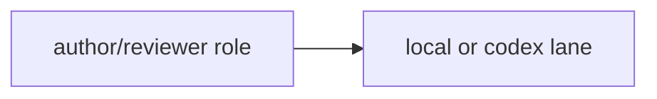

Use this for early adoption, small low-risk work, or when one
operator-by-hand session is driving all roles.

**Author plus independent reviewer**

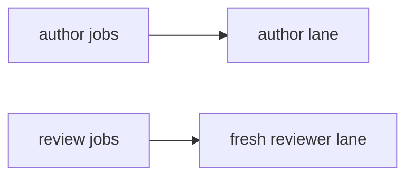

Use this when review independence matters. Pair it with
`fresh_session_required: true` and reviewer policy fields on review
jobs.

**Multi-review lane fan-out**

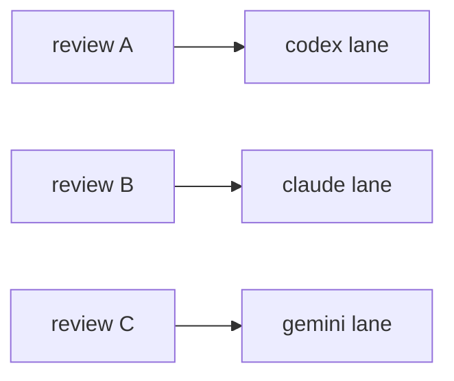

Use this when disagreement is part of the value. The workflow graph
should make the convergence point explicit with a findings ledger,
synthesis, or final review job.

**Supervised lane**

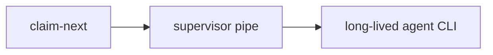

Use this when the agent CLI benefits from persistent context across
work packets. Avoid pointing a supervised lane at a command that reads
one prompt and exits; use a wrapper when the tool needs one.

### Lane Configuration Checklist

For each lane, decide:

- **adapter**: today this is usually `process`.
- **command**: the local command Striatum launches for process-adapter
  runs or supervision.
- **display_model**: the human-readable model name recorded in
  artifacts and evidence.
- **capabilities**: what kinds of jobs the lane is intended to claim,
  such as `write`, `review`, or `synthesis`.
- **constraints**: network, transcript, or repo-scope requests.
- **required_enforcement**: whether validation should reject a lane if
  the adapter cannot enforce a declared constraint strongly enough.
- **harness_profile_id**: optional tool-family metadata exposed in work
  packets.
- **worktree_isolation**: use `per_job` for supervised, agent-loop, or
  parallel repo-write lanes that need isolated worktrees. Non-isolated
  supervised/agent-loop repo-write lanes are accepted only with
  `allow_shared_checkout_repo_write: true` and a non-empty
  `shared_checkout_repo_write_rationale` for explicit interactive-human
  compatibility.

Minimal lane example:

```json
{
  "agent": {
    "adapter": "process",
    "display_model": "Your Agent Model",
    "command": ["your-agent-cli", "run-from-stdin"],
    "capabilities": ["write", "review", "synthesis"],
    "constraints": {
      "transcripts": "off",
      "repo_scope": "local_only"
    }
  }
}
```

Lane names are local workflow vocabulary. A lane named `codex` is only
Codex because its command/profile says so; core scheduling does not
infer provider behavior from the lane id. Replace placeholder command
arrays with the actual invocation shape your agent CLI expects.

## Minimal Bounded Job

Use this when you want Striatum's lease, artifact, and audit discipline
around one well-scoped task, without a review gate.

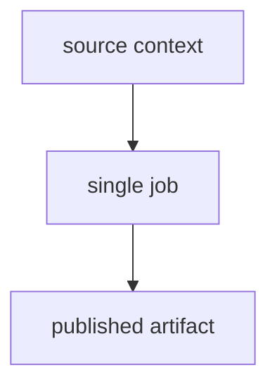

Good fits:

- generate a small report
- produce a migration note
- inspect a narrow source area and publish findings
- create a first draft that will be reviewed outside Striatum

Start with:

```bash
striatum workflow generate --shape minimal --workflow-id my-task --scaffold-root striatum/workflows/my-task --write
```

## Review And Synthesis

Use this when the main value is independent review before the final
recommendation or summary. This is the safest first-contact shape
because it exercises the core runner model without asking an agent to
touch broad source areas.

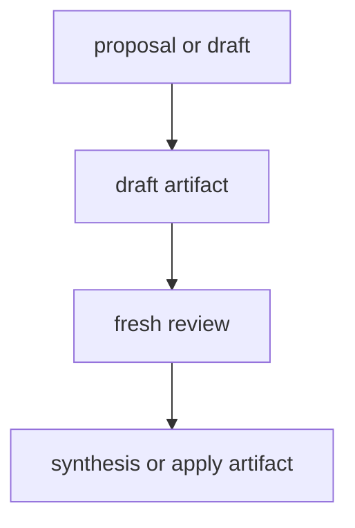

Good fits:

- RFC review
- product proposal review
- TODO-to-plan conversion
- documentation review
- bug triage before implementation

Start with:

```bash
striatum workflow generate --shape review --workflow-id my-review --scaffold-root striatum/workflows/my-review --write
```

## Code Change With Bounded Revision

Use this when the workflow should make a repository change and give
the reviewer one explicit route to send it back for revision.

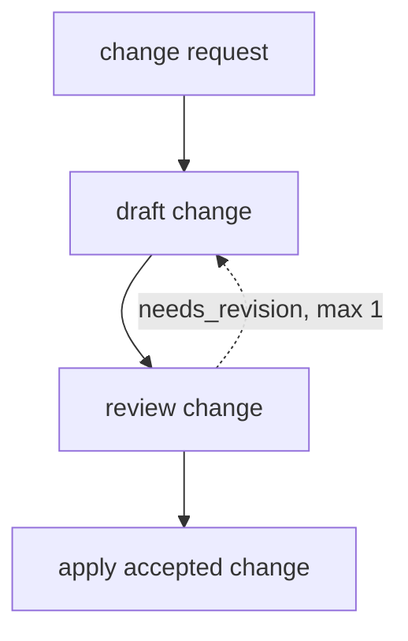

Good fits:

- small code change
- docs change with review
- focused bug fix
- applying accepted review feedback

Start with:

```bash
striatum workflow generate --shape code_change --workflow-id my-change --scaffold-root striatum/workflows/my-change --write
```

## Human Checkpoint

Use this when the runner must stop and wait for an owner decision
before proceeding. The checkpoint is explicit live state, not a
comment in an artifact.

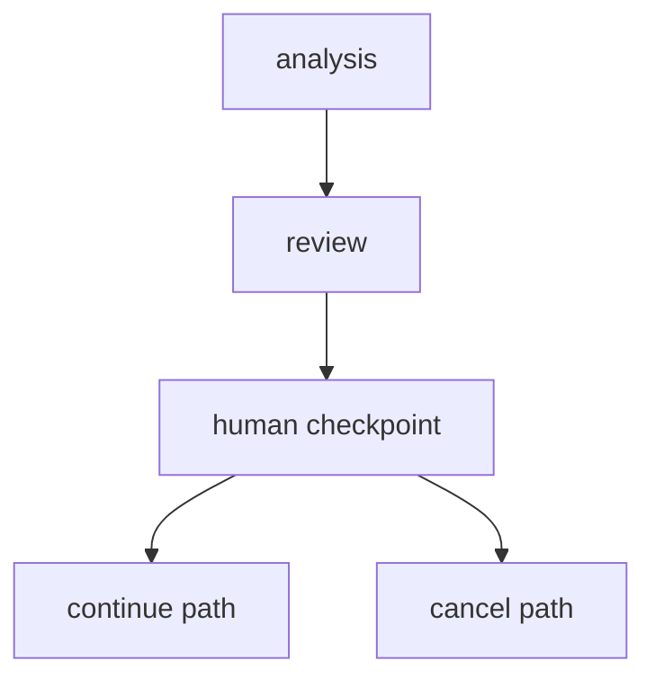

Good fits:

- accept/reject a recommendation before implementation
- choose between competing designs
- approve a risky write scope
- stop a run that surfaced a policy concern

Start from `examples/human-checkpoint-flow/` until there is a
first-class scaffold style for this type.

## Evidence-Backed Artifact

Use this when the output makes claims that should be auditable from
curated evidence, not from an agent's hidden transcript.

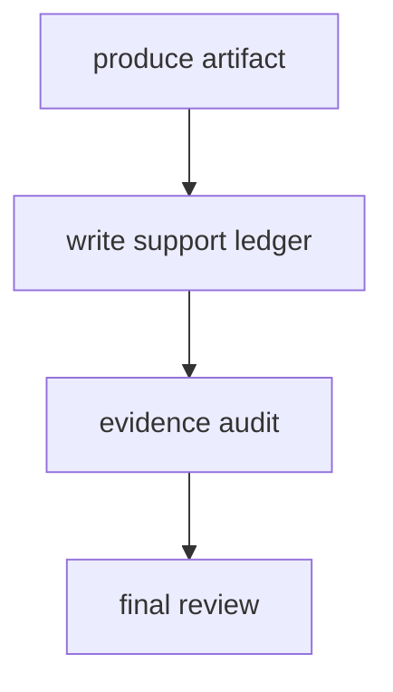

Good fits:

- support-heavy technical recommendations
- decisions that cite file paths, commands, or reports
- claims that another reviewer must verify without replaying a
  model session

Start from `examples/support-ledger-flow/`.

## Multi-Review Synthesis

Use this when disagreement across reviewers is the point. Independent
review artifacts feed a ledger or synthesis job, then a final review
checks the combined recommendation.

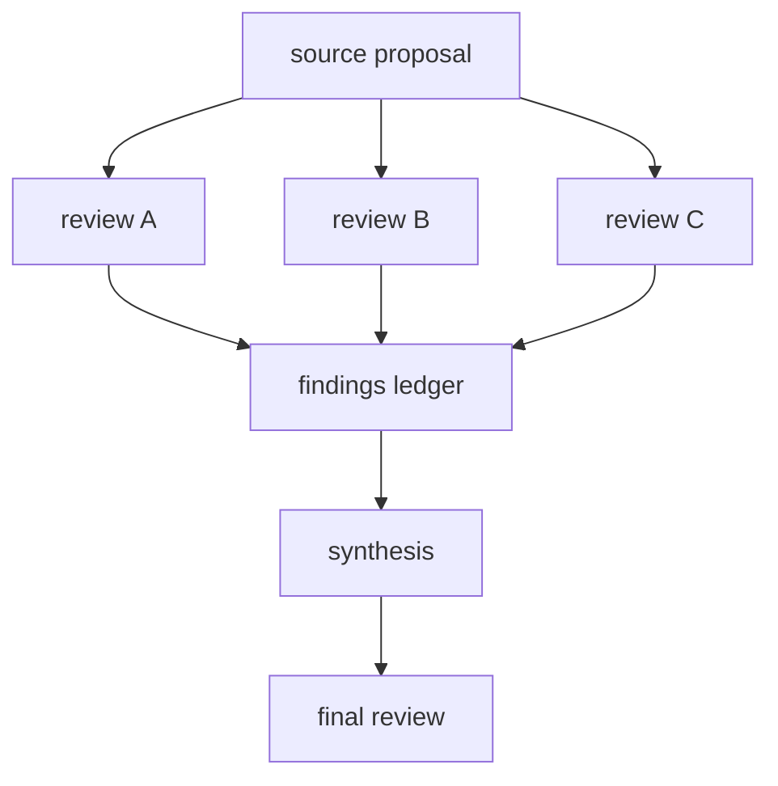

Good fits:

- RFC acceptance
- architecture decisions
- adversarial review across postures
- high-risk implementation plans

Start from `examples/rfc-ledger-cleanup/` for the current generic
shape. Treat `examples/rfc-0014-operational-artifact-home/` and old
P00x prompt material as historical reference unless a task explicitly
asks for that provenance.

## Conversation

Use this for model-to-model dialogue, agent-operator interviews, or
multi-turn reasoning loops over the message bus.

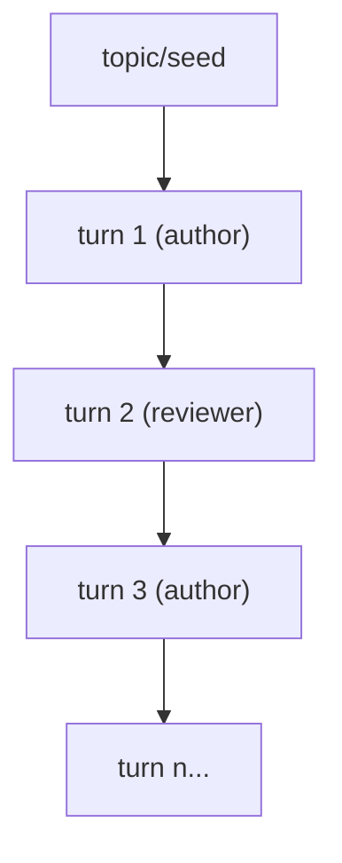

Good fits:

- multi-model reasoning loops
- agent-operator interviews
- structured model-to-model debate
- sequential reasoning where each turn is a distinct model session

Start with:

```bash
striatum workflow generate \
  --shape conversation \
  --workflow-id my-convo \
  --scaffold-root striatum/workflows/my-convo \
  --option topic="your topic" \
  --option turns=5
```

## Review By Interrogation

Use this when artifact-mediated review is not enough — when the reviewer
needs to query the builder's *live, preserved reasoning* rather than only
reading the published artifact. Realized by RFC 0082 interrogation sessions.

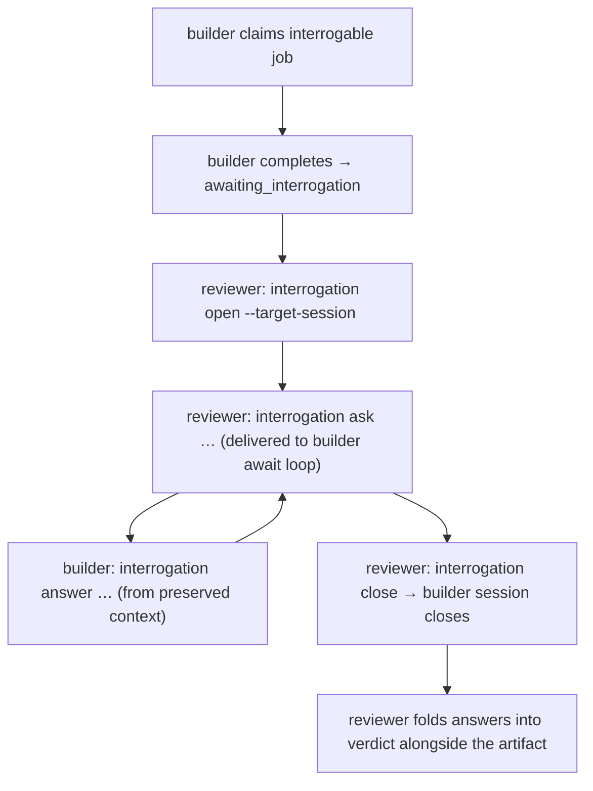

How it works:

- Mark the builder's job `interrogable: true` in the workflow job definition.
  An interrogable builder's `fresh_session_required` is relaxed and its session
  does **not** close on `work.complete`; it enters the `awaiting_interrogation`
  phase, staying live with its context preserved.
- The reviewer session must hold the `interrogate` capability. It opens an
  interrogation against the builder's *live, attested* target session
  (`interrogation.open` fails `target_unavailable` otherwise), asks questions,
  and reads the builder's answers.
- Questions are session-addressed: they ride the message bus and are delivered
  to the target's `work.await_packet` loop, which returns a typed envelope
  (`work_packet` | `interrogation_question` | `none`) and prefers a pending
  question over new work. No other session receives them.
- Interrogation turns are curated records (D028 — never provider
  stdout/stderr) and appear in the RFC 0081 `dialogue` trajectory:
  `striatum trajectory export --profile dialogue`.
- `interrogation.close` terminates the exchange and closes the builder session
  once it holds no active lease and no other interrogation is open against it.

CLI surface:

```bash
striatum interrogation open  --session-id <reviewer> --target-session <builder> --topic "design"
striatum interrogation ask   --session-id <reviewer> --interrogation-id <id> --body "why X?"
striatum interrogation answer --session-id <builder> --interrogation-id <id> --body "because Y"
striatum interrogation list  --run-id <run>
striatum interrogation show  --interrogation-id <id>
striatum interrogation close --session-id <reviewer> --interrogation-id <id>
```

The same verbs are exposed as `interrogation.*` MCP tools to lane agents.

## Static Collaboration Substance Gates

Use these when the point is not merely to collect more reviews, but to force a
published claim through an explicit challenge/rebuttal record before downstream
publication. RFC 0093 V1 ships two generated shapes:

- `falsification_gate`: a holder publishes the leading proposal, falsifiers try
  to disprove that artifact, and an adjudicator gates downstream work on a
  `collaboration_ledger`.
- `cross_examination`: an author publishes a finding or proposal draft, peers
  write falsifying cross-examination challenges, and the challenge/rebuttal
  evidence is recorded before publication.

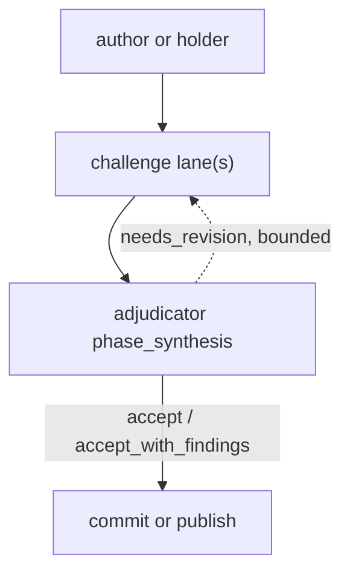

Both shapes emit `striatum.workflow.v1.1`, use ordinary `phase_synthesis` jobs
and cycle routing, and publish a `striatum.collaboration_ledger.v1` artifact.
The adjudicator reads the curated RFC 0081 `dialogue` trajectory, not raw PTY
logs or provider output. A clearing verdict requires at least one referenced
claim, challenge, and rebuttal.

These two bundled generated shapes are sequential static gates over published
artifacts. They do not mark the author or holder job `interrogable`, they do not
keep the author or holder session live, and their prompts do not use the
`interrogation.*` tools. Use the iterated interrogating panel when the workflow
needs preserved-context, live interrogation against an attested target session.
Lane-family independence is a workflow and linting property unless the lane is
supervised and attested by the daemon; a manually registered or unattested
session is not runtime proof of the lane's model family.

Starter fixtures live at `examples/falsification-gate-flow/` and
`examples/cross-examination-flow/`.

## Divergent Ideation

Use this when the goal is to *widen* a design space before narrowing it —
architecture or API choices, naming, fuzzy-bug hypothesis classes, migration
strategy, "give me a few genuinely different ways to do this, then tell me which
survive scrutiny." Every other bundled shape is convergent (draft → review →
apply); this one diverges first. It is the striatum-native, provenance-backed,
provider-portable port of the ADHD method (`UditAkhourii/adhd`, MIT, RFC 0087):

- **Diverge.** `frame_problem` publishes the brief, then N fresh-session diverge
  branches (default 5) each generate ideas under one **cognitive frame** — a
  vantage that distorts how the problem is re-asked — without evaluating. Each
  branch has a unique review-only artifact path, so branches cannot see each
  other. Branches round-robin across the lane ring, so a multi-model lane set
  (e.g. a custom `claude`/`codex`/`agy` set = Opus/GPT/Gemini) carries different
  frames on different models.
- **Converge.** One convergence critic scores every idea on novelty/viability/fit,
  clusters by underlying angle, flags traps, and selects the top-K picks. It runs
  on a different lane/family than branch 1 by default, and explicitly records
  ideas independently surfaced across model families — the **multi-model
  convergence signal** a single-model loop cannot produce.
- **Deepen + synthesize.** K deepen jobs (default 3) expand the survivors
  (sketch, load-bearing risk, first step, child ideas); `final_synthesis`
  assembles the shortlist, the ★ non-obvious pick, the trap list, and a wildcard.
  Each deepen job publishes a `striatum.synthesis.v1` artifact with **uniform
  front matter** across every model lane — an `author:` byline plus a complete
  `inputs:` list naming both the convergence ledger (`CONVERGENCE.md`) and the
  problem brief (`PROBLEM_BRIEF.md`) — so the deepen artifacts stay
  machine-comparable regardless of which model ran the lane.

Frames are a curated, **distortion-axis-tagged** authoring library (RFC 0129):
ADHD's personas plus three categories the method's own multi-model run surfaced
— operation/transform frames (a verb on the problem, not a persona),
temporal-forensic frames (fix a point in time and reason from it), and
risk-pricing frames (price the downside / who is on the hook). The selector
guarantees at least one wild frame, skips operation frames on low-structure
problems, and refuses two frames that share two or more distortion axes in one
run, so a run's branches stay structurally distinct. Frames are an authoring
input, not a persisted schema field.

The shape emits flat `striatum.workflow.v1` (fan-out via `parallel_group` +
edges, like the implementation panel), adds no daemon method, and makes no model
call in any state transition. Generate it with `workflow generate --shape
divergent_ideation`; options: `branch_count` (2–8), `deepen_count` (1–5),
`ideas_per_branch`, `problem_shape` (`low`/`medium`/`high`), `convergence_lane_id`.
A multi-lane set already emits `worktree_isolation: "per_job"` on every
autonomous repo-write lane the fan-out round-robins jobs onto — including a lane
named `reviewer` — so the generated workflow passes `workflow validate` without a
manual `--lane-modifier worktree_isolated`. The starter fixture lives at
`examples/divergent-ideation-flow/`. It is `supported` (graduated D199 per
RFC 0106) on a green RFC 0105 unattended-reliability fixture
(`divergent_ideation_test.go`) proving its double fan-out/join drives to
completion and self-recovers from a branch death in either fan-out, unattended.

## Iterated Interrogating Panel

Use this when a unit of work is high-stakes enough to want both *independent
diversity* and *preserved-context review* — e.g. designing then building a
feature where reasoning-level defects must be caught before landing. It composes
the three-lane fan-out, synthesis, and Review By Interrogation into one reusable
shape (RFC 0083; example at `examples/iterated-interrogating-panel/`).

Two structurally identical loops chained design → build. Each loop:

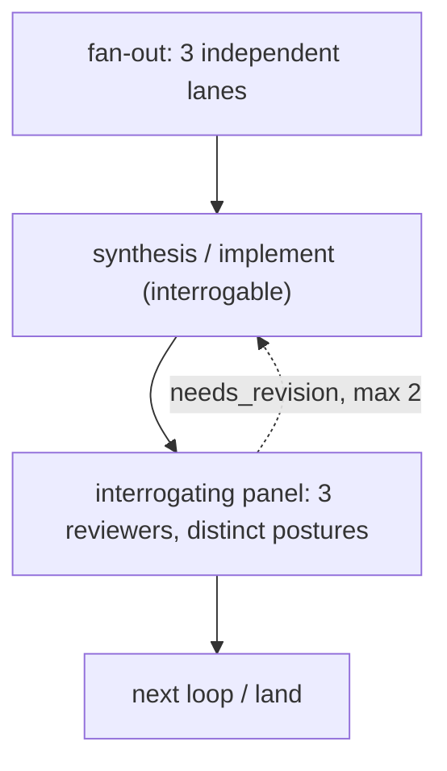

Two **distinct bounded budgets** — do not conflate them:

- **Interrogation rounds:** each panel reviewer runs ≤ 3 `ask`/`answer` rounds
  against the live reviewed session and exits early once its findings resolve.
  Enforced by the reviewer role prompt (the engine does not bound ask/answer);
  the reviewer states how many rounds it used and why it stopped.
- **Revision cycle:** if the panel's aggregate verdict is `needs_revision`, the
  loop returns to the synthesis/implement node — a `cycle` with
  `on_verdict: needs_revision`, `max_iterations: 2`. It does not fire if no
  reviewer dissents.
  - **Final-review fan-in debounce (opt-in, RFC 0154 / D250 #476):** a multi-reviewer
    panel routes the revision on the **first** gating `needs_revision` by default,
    even while sibling final reviewers are still in flight — which can burn a
    bounded `max_iterations` slot on a moving target. Add the opt-in
    `debounce_cohort` field to the `cycle` to wait for the gating cohort before
    routing one consolidated revision pass: `debounce_cohort: all` waits for every
    gating seat that feeds the same downstream gate to report a verdict; an integer
    waits for that many gating seats. The cohort is the frozen gating-seat
    denominator the downstream gate already uses (advisory seats are excluded), so
    it is referenced, not restated. Absent (the default) preserves today's
    first-dissent routing for every existing workflow. No schema migration — it is a
    `workflow_json` field. A late straggler that reports after the consolidated
    route is rendered non-current by the build's bumped `review_generation` (RFC
    0126 / D194) and never triggers a second route.

Notes:

- The reviewed node (synthesis in the design loop, the implementer in the build
  loop) is `interrogable: true` so it stays live for the panel.
- Build fan-out is on the **review** side (one implementation, a 3-wide panel),
  not three competing diffs.
- Execution is **agent-loop-first**: the reviewed lane must run on the MCP
  agent-loop (preserved context), not the `--print` supervised wrapper. Validate
  the workflow with `--allow-same-model-pairing` (a 3-lane/3-posture panel
  necessarily pairs an author's lane with a same-lane reviewer).

```bash
striatum workflow validate --allow-same-model-pairing examples/iterated-interrogating-panel/workflow.json
striatum run prepare --workflow examples/iterated-interrogating-panel/workflow.json
```

## Three-Lane Code And Documentation Audit

Use this when the question is not "is this patch good?", but "where has
the product, source, and documentation drifted?"

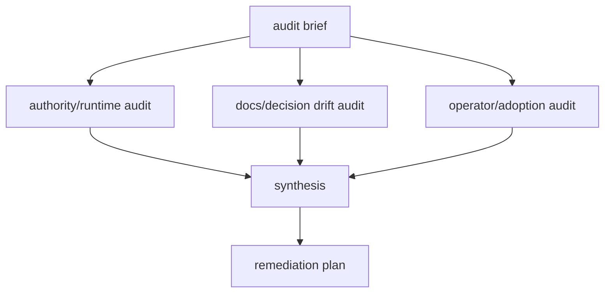

Good fits:

- periodic full-repo audit
- checking half-implemented or superseded RFCs
- release-candidate source/docs consistency review
- validating day-zero operator adoption
- finding gaps between daemon behavior, docs, examples, and TODOs

Start from
`docs/operator/workflows/rfc-0076-code-doc-audit/workflow.json` or
adapt the accepted shape described in RFC 0076 until a generator/catalog
entry lands. The first runnable operator workflow completed on
2026-05-22 with one operator-recovered Claude lane and produced
follow-up work in
`docs/operator/artifacts/rfc-0076-code-doc-audit/REMEDIATION_PLAN.md`.

The audit should produce evidence-backed findings and a remediation
plan, not silently fix every issue it discovers. Tmux panes or terminal
output can help an operator observe a stuck lane, but they are not
workflow state or audit evidence.

## Current UI Path

The local web UI already covers discovery and editing for existing
workflow files:

```bash
striatum --repo "$TARGET_REPO" serve --web --allow-mutations
```

Then open `/workflows/` to browse detected `workflow.json` files,
inspect validation status, preview the graph, edit a workflow, and
run it. The missing layer is a product catalog that starts from
"what kind of workflow do you want?" rather than "which JSON file
already exists?"

## Roadmap To A Chooser

[`RFC 0034`](../rfcs/0034-workflow-generator-and-template-catalog.md)
proposes turning this guide's workflow types and lane sets into a
first-class generator, CLI catalog, and UI chooser.

The roadmap from today's docs and examples to a workflow-selection UI
is:

1. **Document the types.** This guide is the first pass: name the
   workflow families, show the graph shapes, and say which starter is
   closest.
2. **Promote starters into templates.** Define a small blessed set of
   template IDs (`minimal`, `review`, `code-change`, `human-checkpoint`,
   `support-ledger`, `multi-review-synthesis`) instead of asking users
   to infer intent from example directory names.
3. **Add template metadata.** Each template should declare display
   name, summary, recommended use cases, required roles, recommended
   lane sets, artifact layout, and graph preview source. The CLI, docs,
   and UI should all read the same metadata.
4. **Expose CLI catalog verbs.** Add commands such as
   `striatum workflow templates list`, `show`, and
   `init --template <id>` while keeping the existing `--style` flags as
   compatibility sugar.
5. **Add a UI chooser.** Let the operator pick a workflow type, target
   path, output root, lane/profile choices, and optional review
   postures; then open the generated workflow in the existing visual
   builder for validation and run-now.
6. **Add assisted scaffolding later.** Chat-assisted workflow creation
   should write through the same template/catalog surface and the same
   mutation gate. No hosted marketplace or external import is implied by
   this roadmap.

## When Adding A New Type

Add a new type only when it changes operator choice. A different file
layout or prompt wording is usually a template variant, not a new type.

A new workflow type should update:

- this guide, with a graph and starter recommendation
- `docs/WRITING_WORKFLOWS.md`, if the authoring advice changes
- `docs/UBIQUITOUS_LANGUAGE.md`, if it introduces a new term
- `docs/TODO.md` or an RFC, if it implies new product surface
- `examples/`, if there is a runnable generic fixture
