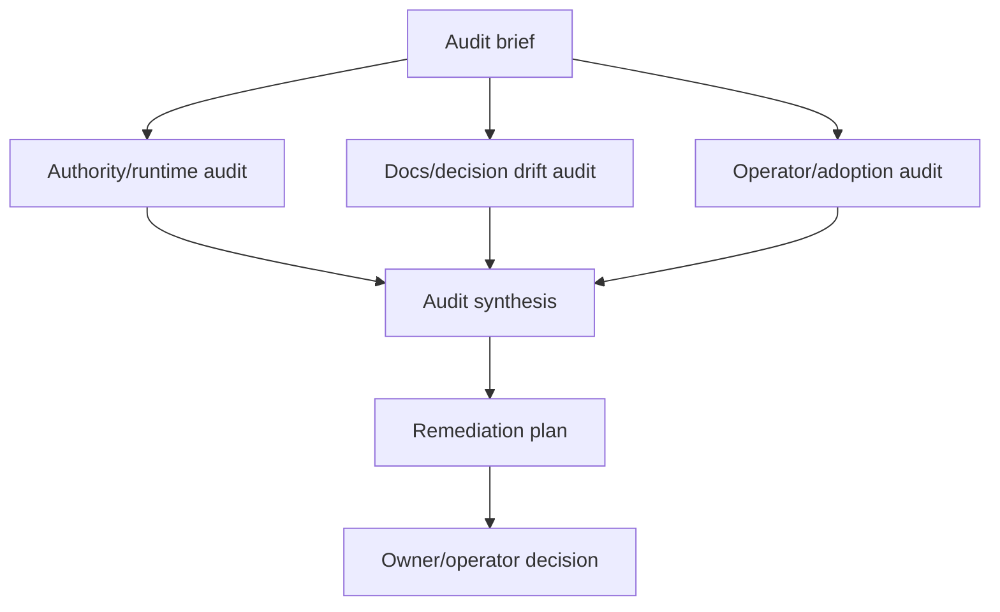

# RFC 0076: Three-Lane Code And Documentation Audit Workflow

Status: accepted
Date: 2026-05-22
author: proposer-codex-gpt-5-001
Context:
[`RFC 0018`](0018-focused-adversarial-review-postures.md),
[`RFC 0034`](0034-workflow-generator-and-template-catalog.md),
[`RFC 0058`](0058-operator-progress-surface.md),
[`RFC 0064`](0064-review-diversity-enforcement.md),
[`RFC 0071`](0071-operator-diagnostics-and-cutover-evidence.md),
[`RFC 0074`](0074-workflow-shape-and-adversary-pack-catalog.md),
[`docs/SPEC.md`](../reference/spec.md),
[`docs/DECISION_LOG.md`](../decisions/decision-log.md),
[`docs/TODO.md`](../reference/todo.md),
[`docs/WORKFLOW_TYPES.md`](../reference/workflow-types.md)

## Current Status

The first runnable RFC 0076 operator workflow has completed:
[`docs/operator/workflows/rfc-0076-code-doc-audit.json`](../operator/workflows/rfc-0076-code-doc-audit.json).
It produced the three lane findings, synthesis, and remediation plan under the
historical generated-record source path
`docs/operator/artifacts/rfc-0076-code-doc-audit/`.

One Claude lane required operator recovery during that run. Treat that as
run evidence, not as a change to the workflow shape's authority model: the
durable findings and remediation plan are the auditable outputs, and tmux
or terminal output remains non-authoritative.

RFC 0076 is accepted by D128 as the reusable three-lane code and
documentation audit workflow shape. Generator/catalog integration remains
future catalog work; hand-authored workflows may use the accepted shape now.
Follow-up remediation is scaffolded in
[`docs/operator/plans/rfc-0076-audit-remediation.md`](../operator/plans/rfc-0076-audit-remediation.md).

## Problem

Striatum is moving quickly across daemon authority, PostgreSQL-only
state, MCP control surfaces, workflow generation, operator docs,
artifact storage, and supervised agent execution. That pace produces a
specific maintenance hazard: source behavior, RFC status, roadmap
claims, examples, operator guidance, and TODO items can drift from each
other.

Single-lane repo reviews tend to collapse different questions into one
large pass:

- Does the code preserve the product boundary and authority model?
- Do the docs accurately describe current source behavior?
- Can an operator or first adopter understand what to do next?
- Which RFCs are half-implemented, superseded, blocked, or stale?

Those questions need different reading postures. A security or authority
reviewer will notice different problems than a docs-drift reviewer or a
new-operator ergonomics reviewer. Running them as one generic review
encourages shallow coverage and makes the final report hard to act on.

Striatum needs a reusable workflow shape for a periodic code and docs
audit: three independent lanes with evidence-backed findings, followed
by synthesis and a prioritized remediation plan.

## Goals

- Define a first-class `code_doc_audit` workflow shape that can be
  represented in docs, examples, and eventually the workflow generator.
- Split audit work into three parallel lanes:
  authority/runtime, docs/decision drift, and operator/adoption.
- Require concrete evidence for every finding: file paths, source
  behavior, tests, command output, docs claims, or decision-log entries.
- Produce a synthesis that deduplicates overlap and assigns every
  material finding to a follow-up path.
- Make superseded, obsolete, blocked, and half-implemented RFCs explicit
  rather than leaving them as oral history.
- Preserve historical fixtures and dogfood records as provenance. The
  audit should flag stale current claims without rewriting history.
- Keep the output actionable for a human principal or AI operator:
  severity, owner surface, recommended next action, and whether the item
  belongs in TODO, a new RFC, an existing RFC, a decision-log update, or
  a wontfix note.

## Non-Goals

- Fixing all findings inside the audit workflow. The audit produces a
  remediation plan; implementation should be separate unless a finding
  is trivial and explicitly assigned.
- Replacing focused code review for a specific patch.
- Replacing `make test`, daemon conformance tests, or authority drift
  tests.
- Treating historical dogfood artifacts as current docs.
- Rewriting accepted decisions without a new decision record.
- Adding broad transcript capture or terminal-output inspection as audit
  evidence.
- Making all three lanes use different model providers. Diversity is
  recommended, but the workflow shape is provider-neutral.

## Proposal

### 1. Workflow graph

The workflow has three parallel audit lanes and one convergence path:



The three audit lanes run independently. They should not read each
other's draft findings before publishing, unless the workflow explicitly
adds a second pass. The synthesis job is responsible for merging
duplicates and resolving conflicting classifications.

### 2. Audit lanes

#### Authority/runtime auditor

Primary question: does current source behavior preserve Striatum's live
authority model?

Coverage:

- daemon-owned PostgreSQL as live state;
- no repo-local SQLite or marker-file authority regressions;
- MCP and daemon RPC method authorization;
- capability-token scope and denial vocabulary;
- lease, heartbeat, stale-lease, recovery, and run-state semantics;
- artifact validation, author/byline rules, and front-matter schemas;
- Go/Python boundary claims during the daemon transition;
- tests that pin the authority boundary;
- examples that might teach retired behavior.

This lane should prefer source, generated contract tables, tests, and
current daemon method metadata over prose.

#### Docs/decision drift auditor

Primary question: do current docs describe current behavior and decision
state honestly?

Coverage:

- `docs/SPEC.md` as product-boundary source of truth;
- `docs/DECISION_LOG.md` accepted, superseded, and obsolete decisions;
- `docs/TODO.md` active, done, blocked, and stale items;
- `docs/ROADMAP.md` current workstream claims;
- RFC status headers and `docs/rfcs/README.md`;
- operator docs, examples, and workflow guides;
- half-implemented RFCs that need Phase status, obsoletion, or a
  follow-up RFC;
- conflicts between docs and source behavior.

This lane should not "clean up" historical dogfood records. It should
distinguish frozen provenance from current product documentation.

#### Operator/adoption auditor

Primary question: can an operator or first adopter use Striatum without
private project memory?

Coverage:

- day-zero setup and daemon startup clarity;
- workflow selection and lane selection;
- MCP and CLI transition guidance;
- tmux/operator introspection and stall handling;
- error messages, recovery paths, and first-run smoke;
- overly complex areas that need a simpler adapter or guide;
- places where file-based artifacts are useful but should not become the
  control plane;
- UI/API gaps that block workflow selection, run observation, or
  recovery.

This lane is allowed to raise product-shape findings, not just doc bugs.
It should still provide evidence and a concrete recommendation.

### 3. Finding record

Each lane should publish a findings artifact with stable finding ids.
V1 can use existing `finding` and `findings_ledger` artifact kinds
instead of adding a new front-matter schema.

Recommended entry shape:

```text
### AUD-001: Short title

severity: critical | high | medium | low | info
category: authority | docs_drift | implementation_gap | operator_ergonomics | test_gap | rfc_status
status: open
claim: One sentence describing the problem.
evidence:
- path/to/file.ext:line - concise evidence
- command or test result, when relevant
impact: Why this matters.
recommended_action: What should happen next.
follow_up: existing TODO/RFC/decision | new RFC | decision-log update | docs fix | test coverage | wontfix
```

Findings without concrete evidence should be downgraded to observations
or open questions. High and critical findings require at least one
source or docs reference and an explicit recommended action.

### 4. Synthesis and remediation plan

The synthesis job produces two artifacts:

- `SYNTHESIS.md`: grouped findings, duplicate merge table, conflicts
  between lanes, and the recommended priority order.
- `REMEDIATION_PLAN.md`: a task-oriented plan that maps each material
  finding to an owner surface.

The remediation plan should classify every high or critical finding as
one of:

- already covered by an existing TODO or RFC;
- needs a new RFC;
- needs a decision-log update;
- needs a docs-only correction;
- needs source/test work;
- historical only, no action;
- accepted risk or wontfix, requiring owner decision.

### 5. Artifact layout

Recommended layout for a run:

```text
docs/audits/<YYYY-MM-DD>-code-doc-audit/
  authority-runtime/FINDINGS.md
  docs-decision-drift/FINDINGS.md
  operator-adoption/FINDINGS.md
  SYNTHESIS.md
  REMEDIATION_PLAN.md
  DECISION.md
```

`DECISION.md` is optional until the human principal or AI operator
accepts a remediation direction. If present, it should use the existing
decision artifact schema.

### 6. Scope presets

The same workflow shape should support several scopes:

| Preset | Use when | Typical input |
|---|---|---|
| `full_repo` | Periodic broad audit. | Repo root plus current roadmap. |
| `rfc_cluster` | A group of related RFCs may have drifted. | RFC ids, docs, tests, and implementation paths. |
| `release_candidate` | A version is about to ship. | Changelog, tag diff, tests, release docs. |
| `subsystem` | One bounded area needs pressure. | Paths such as `go/pkg/mcp`, `docs/operator`, or `src/striatum/web`. |
| `adoption_path` | First-user experience needs validation. | `README`, `USING_STRIATUM`, install/runbook docs. |

V1 can represent the preset in the audit brief. A future generator can
turn it into workflow options.

### 7. Generator/catalog integration

RFC 0074 expands the catalog from flat graph shapes toward graph shape,
lane set, role pack, and adversary pack. This RFC proposes:

- graph shape: `code_doc_audit`;
- role pack: `authority_docs_operator_audit`;
- default adversary pack: `authority_drift`, `docs_drift`,
  `operator_ergonomics`;
- suggested lane set: three fresh model lanes where available, or three
  fresh sessions on one lane when provider diversity is not available.

The workflow generator should eventually produce a validated workflow
tree for this shape, but the RFC can be useful before generator support
exists.

## Acceptance Criteria

- A runnable example workflow exists for `code_doc_audit`.
- `docs/WORKFLOW_TYPES.md` describes when to use the audit shape.
- The RFC index links this RFC.
- A generated or hand-authored audit workflow validates with
  `striatum workflow validate`.
- The workflow produces three independent findings artifacts plus a
  synthesis and remediation plan.
- Findings include stable ids, severity, category, evidence, impact, and
  recommended action.
- The synthesis maps every high or critical finding to a follow-up path.
- Historical fixtures are preserved as historical unless a current doc
  claims their behavior is still live.
- At least one dogfood or operator-run audit uses this shape before it
  is marked accepted. The first operator run completed on 2026-05-22
  with one operator-recovered Claude lane; D128 records the owner
  acceptance decision.

## Open Questions

- Should audit findings get a dedicated `striatum.audit_finding.v1`
  front-matter schema, or is the existing `finding` schema enough?
- Should the workflow require model-family diversity, or only fresh
  sessions with declared review postures?
- Should `REMEDIATION_PLAN.md` be a new artifact kind or a normal
  synthesis/handoff artifact?
- Should the generator include a default "broad repo audit" prompt, or
  require the operator to provide a scoped audit brief every time?
- Should the operator UI surface audit findings as a durable issue-like
  queue?

## Domain Modeling

This RFC adds a workflow shape and role pack, not a new live-state
authority.

The audit lanes produce artifacts. The synthesis job turns artifacts
into a remediation plan. The human principal or AI operator may later
accept, reject, split, or defer the plan through existing decision
artifacts and TODO/RFC updates.

In DDD terms, `code_doc_audit` is a catalog value object. An individual
finding remains an artifact-backed claim until accepted into a decision,
TODO item, RFC, issue, or source change.
