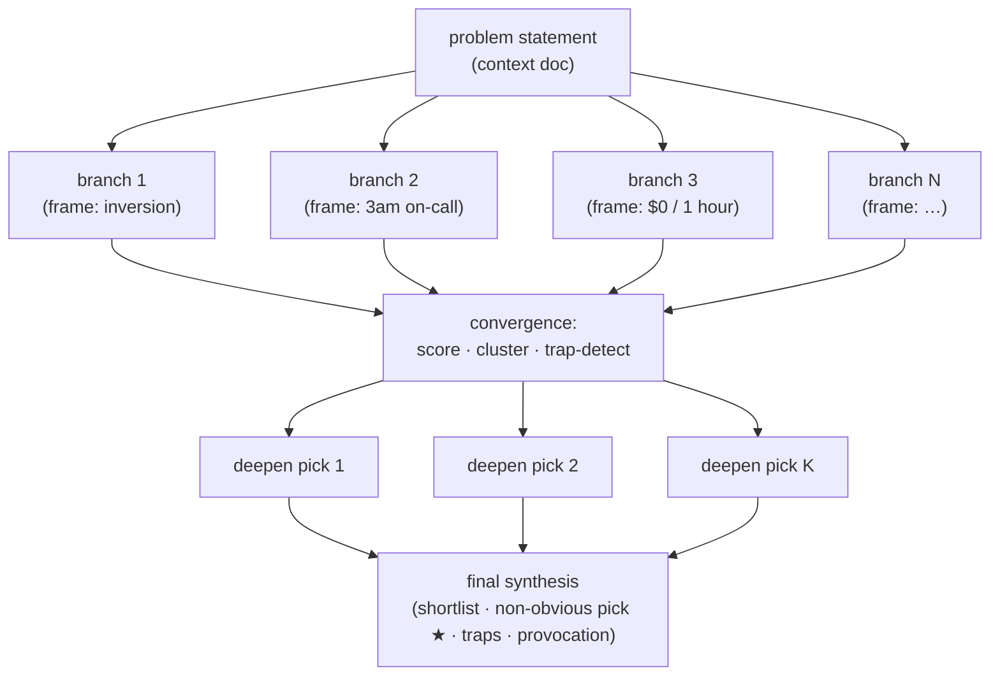

# RFC 0087: Divergent Ideation Workflow Shape

Status: accepted (implemented 2026-06-14; frame layer per RFC 0129)
Date: 2026-05-27
Implementation note (2026-06-14): the `divergent_ideation` shape is implemented
first-class in `go/pkg/workflowgenerate/shapes_divergent.go` (registered in the
`shapes` set, the dispatch switch, and the template catalog at the `supported`
tier — graduated D199 per RFC 0106 on a green RFC 0105 reliability fixture
(`go/pkg/adapterconformance/divergent_ideation_test.go`)) with a starter fixture
at `examples/divergent-ideation-flow/`. It compiles
to flat `striatum.workflow.v1` (fan-out via `parallel_group` + edges, like
`implementation_panel`) rather than the v1.1 phases sketched below — the proven
shipped fan-out pattern. The frame library and selection policy moved to
[RFC 0129](0129-cognitive-frame-library.md) (`frames.go`); the flat default-pack
table below is superseded by it.
Context:
- Prior art: [`UditAkhourii/adhd`](https://github.com/UditAkhourii/adhd)
  ("ADHD" — tree-of-thought-with-pruning skill for coding agents, MIT
  license). The frame/critic prompt design in its `skills/adhd/SKILL.md`
  is the direct inspiration for the graph shape proposed here.
- [RFC 0034](0034-workflow-generator-and-template-catalog.md) — workflow
  generator and template catalog (the surface this shape plugs into).
- [RFC 0074](0074-workflow-shape-and-adversary-pack-catalog.md) — graph
  shapes, role packs, and adversary packs (this RFC adds a sibling
  "frame pack" authoring input).
- [RFC 0045](0045-multi-phase-workflow-editor-and-schema.md) — multi-phase
  workflow shape (`striatum.workflow.v1.1` `phases` + `phase_synthesis`),
  which this shape compiles onto.
- [RFC 0018](0018-focused-adversarial-review-postures.md) — review
  postures (contrast: postures are adversarial *reading* coverage; frames
  are generative *vantages*).
- [RFC 0052](0052-committee-deliberation-workflow.md) — committee
  deliberation (contrast: convergence-by-debate; this RFC is
  divergence-then-prune).

## Problem

Striatum coordinates multi-agent work, but every bundled workflow shape is
*convergent*: a draft is reviewed, findings are synthesized, a change is
applied. None of the shapes are built to deliberately *widen* a design space
before narrowing it. For open-ended questions — architecture choices, API
design, naming, fuzzy-bug hypotheses, migration strategy — the first viable
answer an agent produces is rarely the best one, because autoregressive
generation conditions each token on the last and gets trapped near the
obvious. Operators who want "give me a few genuinely different ways to do
this, then tell me which survive scrutiny" have to hand-author a bespoke
`workflow.json` every time.

External agent skills like ADHD solve the divergence problem *inside a single
agent session*: they fan out N isolated model calls under different cognitive
"frames," forbid evaluation during divergence, then run a separate critic pass
to score, cluster, detect traps, and deepen survivors. That works, but the
divergence is ephemeral — it lives and dies inside one `query()` loop, leaves
no durable provenance, is Claude-only (built on the Claude Agent SDK), and is
invisible to Striatum's leases, verdicts, and audit chain.

Striatum already has every primitive needed to do the same thing *with*
provenance, *with* provider portability, and *with* reviewer independence —
parallel jobs, fresh-session isolation, disjoint write scopes, findings
ledgers, synthesis jobs, and multi-phase gating. What is missing is a named
graph shape that wires those primitives into the diverge → prune → deepen
loop, plus the small authoring vocabulary (cognitive frames) that makes each
branch meaningfully different.

## Goals

1. Add a `divergent_ideation` graph shape to the RFC 0034 generator that
   compiles to ordinary `striatum.workflow.v1.1` jobs, edges, cycles, and
   phases — no new runtime engine, no daemon method, no schema authority.
2. Introduce a **frame pack** authoring input (sibling to RFC 0074 role packs
   and adversary packs): a named, reusable set of generative vantages that the
   generator binds to divergence branches. Frame packs are catalog/authoring
   data, not live runner state.
3. Make divergence isolation a first-class property of the generated graph:
   each branch is a fresh-session job with a unique review-only artifact path,
   so branches provably cannot read each other's output during divergence.
4. Make the convergence output auditable: scores, clusters, trap detection,
   the non-obvious pick, and the deepened sketches land as durable artifacts,
   not as transient model output.
5. Preserve provider portability: a divergence branch can be assigned to any
   declared lane (`codex`, `claude`, `gemini`, …), so the same shape can run
   single-provider or mixed-provider. This is a strict superset of ADHD's
   Claude-only behavior.

## Non-Goals

- **No vendor SDK, no Node/TypeScript dependency, no `import` of ADHD or the
  Claude Agent SDK** anywhere in the runner. Per `docs/SPEC.md` § Product
  Boundary and the Go-only runtime (RFC 0078), the core never imports a model
  vendor. This RFC borrows ADHD's *prompt design and graph shape* (MIT
  licensed), not its code.
- No runtime "divergence engine" that auto-spawns branches outside the
  declared workflow graph. Divergence is expressed as ordinary jobs the
  scheduler already understands; the number of branches is fixed at
  generate/prepare time, not chosen dynamically by the daemon.
- No replacement for RFC 0052 committee deliberation. Committees converge by
  debate under an arbitrator; this shape diverges first and prunes. They are
  complementary, not competing.
- No new capability in the daemon method registry. No external API call during
  any state transition (the model calls happen inside agent lanes, exactly
  where they already happen for every other shape).
- No change to how lanes execute. Branch isolation is enforced by existing
  fresh-session + write-scope rules, not by a new sandbox.

## Proposal

### Shape overview

`divergent_ideation` compiles to a three-phase multi-phase workflow
(`striatum.workflow.v1.1`):

- **Phase 1 — Diverge.** N parallel `build`-typed branch jobs (default
  `N = 5`). Each branch job is bound to one cognitive frame and instructed to
  produce several short, distinct ideas *without evaluating them*. Each branch
  has `fresh_session_required: true`, a `reviewer`-style review-only write
  scope with a unique artifact path (`<artifact_root>/branches/branch-<i>.md`),
  so branches cannot see each other during divergence. Branches may be bound
  to the same lane or spread across lanes per the lane set.
- **Phase 2 — Converge.** One synthesis job reads all branch artifacts and
  produces a convergence artifact: every idea scored on novelty / viability /
  fit, grouped into clusters by underlying angle, with traps (seductive but
  broken ideas) called out and the top-K picks selected by weighted score.
- **Phase 3 — Deepen + final synthesis.** K parallel `build` jobs (default
  `K = 3`), one per surviving pick, each producing a deepened sketch
  (load-bearing risk, first concrete step, child ideas). A final synthesis job
  assembles the operator-facing result: shortlist, the non-obvious viable pick
  flagged ★, the trap list, and a wildcard provocation.

The two phase-transition gates are ordinary RFC 0045 `phase_synthesis` jobs, so
no deepen job can start before convergence completes and no final synthesis can
start before all deepen jobs finish.

### Frame packs

A **frame pack** is a named authoring input — structurally a sibling to RFC
0074 role packs and adversary packs — that names a set of generative vantages.
Each frame carries an id, a short vantage instruction, and tags for selection
(`code` / `design` / `general` / `wild`). The bundled catalog ships a default
pack adapted from ADHD's frame table, for example:

> **Status note (2026-06-14, RFC 0129).** The flat default-pack table below was
> copied from ADHD's `SKILL.md` and is persona-only. [RFC 0129](0129-cognitive-frame-library.md)
> supersedes this frame layer with a categorized, curated library (`frame_kind` +
> distortion-axis dimensions; three new categories — operation/transform,
> temporal-forensic, risk-pricing), an anti-redundancy selection policy, and a
> multi-model convergence signal. RFC 0087 retains ownership of the graph/phase
> mechanics; the frame library and its selection policy move to RFC 0129.

| Frame id | Vantage (instruction seed) | Tags |
|---|---|---|
| `inversion` | Ask the opposite question, then negate the answer back | code, design, general |
| `remove_assumption` | Imagine a load-bearing framework / DB / model is gone | code, design, wild |
| `extreme_cheap` | Crudest version that ships in $0 and one hour | code, general |
| `extreme_lavish` | Maximalist version with infinite budget and ten years | design, wild |
| `on_call_3am` | Design to prevent the page that wakes you at 3am | code, design |
| `speedrunner` | Glitches, skips, frame-perfect shortcuts | code, wild |
| `logistics` | Queues, batching, hub-and-spoke | code, design |
| `biology` | Immune systems, neural plasticity, evolution | code, wild |
| `markets` | Buyers, sellers, auctions, clearing houses | design, wild |
| `naive` | A bright ten-year-old with no priors | general, wild |

Frame packs are **not live runner state.** Like role packs and adversary
packs (RFC 0074, see `docs/UBIQUITOUS_LANGUAGE.md`), they exist only as
generator/catalog authoring inputs; a generated workflow persists only ordinary
jobs whose prompt context carries the chosen frame's vantage instruction. The
generator selects frames per ADHD's heuristic (for `code`-flavored problems,
draw mostly from `code`/`design` frames plus at least one `wild` frame) and
varies the selection across generations so repeated runs explore differently.

The frame instruction is injected into the branch job's prompt context (via the
job's `context_docs` / role-definition seed), not into any persisted schema
field. The generator is the only place that knows about frames; the validator,
scheduler, and daemon see ordinary jobs.

### Generator spec fields

`workflow generate --shape divergent_ideation` accepts these options on the
`striatum.workflow_generator.v1` spec, all with defaults:

- `branch_count` (default 5) — Phase 1 branch jobs.
- `ideas_per_branch` (default 6) — advisory, surfaced in the branch prompt;
  not enforced structurally.
- `deepen_count` (default 3) — Phase 3 deepen jobs.
- `frame_pack_id` (default the bundled `default` pack).
- `score_weights` (default `{novelty: 0.35, viability: 0.40, fit: 0.25}`) —
  surfaced in the convergence prompt; the runner does not compute scores.
- standard generator fields (`lane_set`, `artifact_root`, `scaffold_root`,
  `branch.suggested_name`, lane commands).

`lane_set: "local"` keeps the existing `workflow init --style` sugar working;
`multi_review` or a custom lane set spreads branches across providers.

### Convergence artifacts

Phase A reuses existing artifact kinds to avoid expanding the contract surface:

- Each divergence branch publishes a `finding` artifact
  (`striatum.finding.v1`) — already a review/idea-shaped kind.
- The convergence job publishes a `findings_ledger`
  (`striatum.findings_ledger.v1`) carrying the scored/clustered pool.
- Each deepen job and the final synthesis publish `synthesis` artifacts
  (`striatum.synthesis.v1`).

Phase B (optional, see Open Questions) may add a dedicated
`striatum.ideation_synthesis.v1` front-matter schema that makes the
structured output machine-readable — `shortlist[]`, `non_obvious_pick`,
`traps[]`, `clusters[]`, `deepened[]` — so downstream tooling and corpus
export can read picks and traps without parsing prose. Phase B is deferred
until Phase A has run at least once in a dogfood.

### Why this respects the product boundary

- The model calls live in agent lanes, like every other shape. No state
  transition calls an external service (`docs/SPEC.md` § Corpus Export And
  Augmentation Boundary invariants are untouched).
- Branch isolation uses `fresh_session_required` + unique review-only artifact
  paths — mechanisms the runner already enforces — not a new sandbox.
- Provider portability is preserved and extended: ADHD is Claude-only; this
  shape runs on any lane.
- The whole feature is generator + catalog (+ optional artifact schema). It
  adds no daemon method, no Go runtime engine, and no vendor import.

## Acceptance Criteria

1. `workflow generate --shape divergent_ideation` (Go generator path)
   produces a `striatum.workflow.v1.1` tree that passes
   `workflow validate` and `workflow lint` with no errors, for the default
   options and for `branch_count`/`deepen_count` overrides within bounds.
2. The generated graph has exactly `branch_count` Phase 1 branch jobs, each
   with `fresh_session_required: true` and a distinct review-only artifact
   path; the validator's disjoint-write-scope / unique-artifact-path checks
   pass.
3. Phase gating is enforced: no deepen job is reachable before the convergence
   `phase_synthesis` gate; final synthesis is unreachable before all deepen
   jobs complete (RFC 0045 cross-phase-dependency validator rules hold).
4. A bundled `default` frame pack exists in the template catalog, exposed
   through `workflow templates list/show`, and the generator selects and
   varies frames across repeated generations.
5. A reference fixture lands at
   `examples/divergent-ideation-flow/workflow.json` and validates in CI.
6. Docs updated: `docs/WORKFLOW_TYPES.md` (new shape entry),
   `docs/WORKFLOW_CATALOG.md` (generated catalog reference),
   `docs/UBIQUITOUS_LANGUAGE.md` (`frame pack`, `divergent ideation` shape),
   and `docs/SPEC.md` § Workflow Config shape list. ADHD attribution (MIT)
   recorded in this RFC's Context.
7. No new daemon method, no `memory.*`/vendor capability, no Node/TS or Claude
   Agent SDK import is introduced; the RFC 0078 Python-trace and augmentation
   guardrails stay green.
8. (Phase B, if accepted) `striatum.ideation_synthesis.v1` is registered in
   `go/pkg/artifactcontracts`, `publish-artifact` validates it, and a fixture
   exercises shortlist/traps/non-obvious-pick fields.

## Open Questions

1. **Frame pack location.** Catalog-only (bundled package data, like adversary
   packs) for V1, or also allow a workflow-authored inline frame list? Proposal
   leans catalog-only for V1 to match RFC 0074's pack model.
2. **Typed convergence artifact (Phase B).** Is the structured
   `ideation_synthesis.v1` worth a new front-matter schema, or do
   `findings_ledger` + `synthesis` carry enough? Defer until one dogfood run
   shows whether downstream consumers need machine-readable picks/traps.
3. **Trap detection vs verdicts.** Traps are an output annotation of the
   convergence job, not a `reject` verdict on a branch. Should a branch judged
   to be all-traps receive a `needs_revision`-style signal, or is annotation in
   the ledger sufficient? Proposal: annotation only — divergence branches are
   not review jobs and should not be gated.
4. **Cost guardrails.** A run is `branch_count + 1 + deepen_count + 1` jobs
   (default 10), each a model invocation — the same order as ADHD's ~10 calls
   and well within existing multi-agent shapes. Do we want an advisory lint
   warning when `branch_count` exceeds, say, 8?
5. **Cross-repo.** Divergent ideation is single-repo by intent; cross-repo
   shape is out of scope for V1.

## Domain Modeling

Per [`docs/DDD.md` § "Adding to the model"](../reference/domain-driven-design.md#adding-to-the-model)
(precedent: RFC 0019):

- **Frame pack** is a **value object** and an *authoring input*, not an
  aggregate or live-state entity — identical in kind to RFC 0074 role packs and
  adversary packs. It is consumed by the generator and leaves no persisted
  schema field; only ordinary jobs with frame-seeded prompt context survive
  into the workflow snapshot.
- **`divergent_ideation`** is a **workflow shape** in the existing glossary
  sense: a generator graph-family choice that compiles to ordinary jobs,
  edges, cycles, and phases. It is *not* a persisted `workflow.json` field and
  introduces no new aggregate root.
- The optional **`ideation_synthesis`** (Phase B) is an **artifact** with a
  registered front-matter schema — a value object recorded as durable
  provenance, validated by the publisher, never rewritten.
- **Boundary clarification.** This RFC lives entirely in the generator +
  template-catalog bounded context (+ the artifact-contract context for the
  optional Phase B schema). It deliberately does *not* touch the daemon method
  registry, the scheduler, the adapter boundary, or the augmentation boundary.
  No new domain event is introduced; divergence branches emit the existing
  `artifact.published` / job lifecycle events like any other build job.
