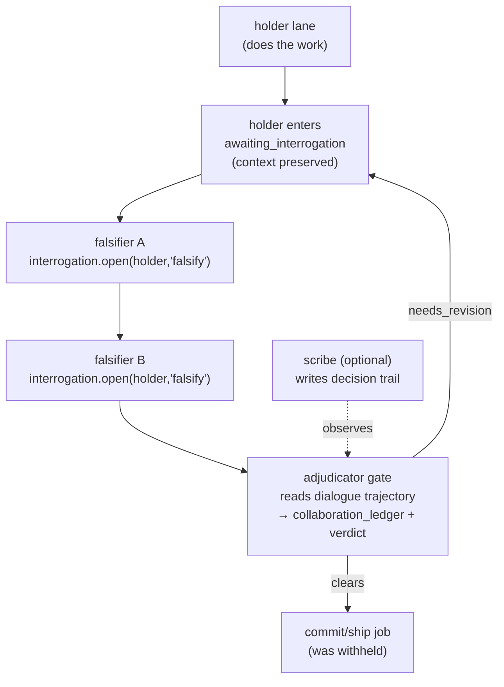

# RFC 0093: Structured Live-Collaboration Workflow Shapes (Substance-Gated Dialog)

Status: accepted (V1 landed 2026-05-29, D155)
Date: 2026-05-29
author: proposer-claude-opus-4-8-001
Accepted: 2026-05-29 (D155). V1 landed on `main` `7d465fd` (impl `81a746b`):
the `collaboration_ledger.v1` contract, the cycle router (shared with #63
F1/F3), the `adjudicator` role + `phase_synthesis` substance gate, and the
`falsification_gate` / `cross_examination` generator shapes + `scribe`
modifier. `fog_of_war_review`, `synaptic_prune`, and `post_dialog_hook` are
deferred. Built via a 3-lane design+build dogfood whose interrogating panel
caught the cycle-ledger deadlock and the verdict-bypass before merge.
Context:
- [RFC 0082](0082-interrogation-sessions.md) — interrogation sessions: the 1→1
  asymmetric live primitive (`interrogation.{open,ask,answer,close,list,show}`)
  against a *preserved-context* target. The base primitive this RFC composes.
- [RFC 0086](0086-multiparty-conversation.md) — symmetric N-party conversation
  (`conversation.{open,say,close,list,show}`, round-robin floor, shared
  transcript) (D144). The other base primitive. Its noted-but-unbuilt
  moderator/nominator floor variant is an Open Question here.
- [RFC 0081](0081-conversation-trajectories.md) — the `dialogue` trajectory
  read-model every shape here observes; `trajectory export --profile dialogue`.
- [RFC 0083](0083-iterated-panel-review-with-interrogation.md) — iterated panel
  review with interrogation. The *single* live-collaboration shape that exists
  today; this RFC generalizes it into a named family.
- [RFC 0084](0084-interrogable-agent-loop-attestation-and-chat-ui.md) —
  `awaiting_interrogation` agent-loop targets (D141) + the chat UI (D142) that
  renders these dialogs.
- [RFC 0092](0092-live-agent-conversation-ui-and-d028-supersedence.md) — D028
  narrowed to permit *ephemeral* SSE streaming of live dialogue while keeping
  raw stdout/stderr non-authoritative. Bounds what "live" may surface.
- [RFC 0087](0087-divergent-ideation-workflow-shape.md) — the **contrast and
  sibling**: divergence via *fresh-session isolated* static jobs that provably
  *cannot* see each other. This RFC is its preserved-context inverse: shapes
  that are impossible without the context sharing 0087 forbids.
- [RFC 0052](0052-committee-deliberation-workflow.md) — committee deliberation:
  convergence-by-debate via *typed artifact* debate turns under an arbitrator.
  Overlapping intent, different substrate (see Non-Goals / Open Questions).
- [RFC 0034](0034-workflow-generator-and-template-catalog.md) /
  [RFC 0045](0045-multi-phase-workflow-editor-and-schema.md) /
  [RFC 0074](0074-workflow-shape-and-adversary-pack-catalog.md) — the generator,
  multi-phase gating, and pack-catalog surfaces this shape family plugs into.
- [`docs/decisions/decision-log.md`](../decisions/decision-log.md) — D028
  (curated-text-only, as narrowed by RFC 0092), D026 (lane attestation), D144.
- Provenance note: the shape catalog in §3 originated from a divergent-ideation
  pass (the manual analogue of RFC 0087) run on these primitives; this RFC keeps
  the survivors and the one mechanism they all share.

## Problem

Striatum now has two live model-to-model dialog primitives — interrogation
(RFC 0082, 1→1, asymmetric) and multi-party conversation (RFC 0086, N-party,
symmetric, round-robin) — and has proven both in the small: basic 3-round
3-way dialogs, and interrogation folded into one review shape (RFC 0083). But
the primitives are *unstructured exchange*. A conversation runs round-robin
until `max_rounds`; an interrogation runs ask/answer until someone closes it.
Neither *gates a decision* on the exchange, and there is no named family of
collaboration shapes that wire these primitives into a workflow whose output is
better than a single model or a flat dialog.

Two gaps follow:

1. **No catalog of live-collaboration shapes.** RFC 0083 is the only one, hand-
   shaped for design→build review. Operators who want "one model holds the
   context, the others must try to break its conclusion before we commit," or
   "split the spec so each lane must interrogate the others to reconstruct it,"
   or "after the conversation, each lane nominates one claim to retire" must
   hand-author a bespoke `workflow.json` and drive the dialog calls by hand —
   exactly the freestyling RFC 0034 set out to end for static shapes.

2. **No substance-gate — the load-bearing gap.** The obvious way to gate a
   decision on a dialog is to gate on the dialog *completing*: the interrogation
   closed, `max_rounds` was reached, every lane took a turn. Every such gate is
   satisfiable by **ritual** — hollow questions ("anything else important?"),
   fluent non-answers, vocabulary that *sounds* like convergence. The gate
   passes while the epistemic work it was supposed to force never happened. A
   divergent-ideation pass on these primitives surfaced this independently from
   three unrelated framings; it is the single risk shared by every otherwise-
   strong shape. We lack a mechanism that gates on *whether the exchange did its
   work* — a constraint was actually extracted, a challenge actually landed and
   was actually rebutted — rather than on turns having occurred.

RFC 0083 sidesteps both by baking one shape and one human-or-reviewer judgment
into a fixture. That does not generalize. This RFC names the family and, more
importantly, defines the one mechanism the family needs: an **adjudicator role**
that reads the dialogue trajectory and emits a **substance verdict** that gates
the downstream commit.

## Goals

1. Define a **collaboration shape pack**: a named, catalog-only authoring input
   (sibling to RFC 0074 role/adversary packs and RFC 0087 frame packs) that
   binds a live-dialog collaboration shape to a generated workflow. Shapes
   compile to ordinary `striatum.workflow.v1.1` jobs/phases plus calls to the
   *existing* RFC 0082/0086 daemon methods. No new live-dialog primitive.
2. Define the cross-cutting **substance-gate**: an **adjudicator** role (a job
   that reads the `dialogue` trajectory, never raw stdout) that emits a typed
   verdict on *whether the dialog extracted the substance it was meant to*, and
   a phase gate that withholds the downstream commit/proposal job until that
   verdict clears. This is the reusable anti-theater mechanism; every shape
   binds it.
3. Ship a V1 catalog of shapes that are **pure composition** of existing
   primitives plus the gate: `falsification_gate`, `fog_of_war_review`,
   `synaptic_prune`, `cross_examination`, and a `scribe` participant modifier.
4. Add at most one new artifact contract — a `striatum.collaboration_ledger.v1`
   front-matter schema (the adjudicator's structured record: claims,
   challenges, rebuttals, extracted constraints, verdict) — reusing
   `finding`/`findings_ledger`/`synthesis` where they already fit.
5. Preserve the product boundary verbatim: daemon-owned PostgreSQL stays the
   sole live-state authority and sole writer; dialog turns stay curated
   authored-text-only (D028 as narrowed by RFC 0092); no external service, no
   vendor SDK, local-first; provider-portable across `claude` / `codex` /
   `gemini` lanes with models pinned per lane (RFC 0086).
6. Make every shape observable and human-joinable: each renders in the RFC 0084
   chat UI as it runs, and the substrate is designed so a human operator can
   occupy any role seat (falsifier, judge, pruner) via the same interrogation
   path (see Open Questions / Domain Modeling).

## Non-Goals

- **No new live-dialog primitive.** This RFC adds no `conversation.*` /
  `interrogation.*` method. The moderator/nominator floor control RFC 0086 left
  as a follow-up is *not* a dependency; shapes that would prefer it must degrade
  gracefully to round-robin (Open Question 1).
- **No fabricated economy or cross-run reputation.** The divergent pass produced
  an attractive cluster of market/auction/stake/reputation shapes (bid context
  tokens for a turn, settle a prediction market, earn veto credits). They assume
  a currency and a cross-run reputation store that do not exist; V1 is single-
  run-scoped (RFC 0082/0086) and has nothing to settle against. They are
  explicitly out of scope as false economies. (The lone salvageable variant —
  forecasts settled against the *test suite* — is parked in Open Questions.)
- **No replacement of RFC 0052 or RFC 0083.** RFC 0052 converges by *typed
  debate-turn artifacts* under an arbitrator; this RFC operates on *live
  preserved-context dialog* gated by an adjudicator. RFC 0083 becomes one
  catalog entry expressed in the new vocabulary, not a deletion. The two debate
  models are complementary; reconciling them is an Open Question, not a goal.
- **No raw transcript capture.** D028 (as narrowed by RFC 0092) stands: the
  adjudicator reads the curated `dialogue` trajectory and authored turn text,
  never provider stdout/stderr; ephemeral SSE of live turns is display-only.
- **No runtime "collaboration engine"** that spawns dialog rounds outside the
  declared graph. Round count and shape are fixed at generate/prepare time; the
  daemon sees ordinary jobs plus the existing dialog methods.

## Proposal

### 1. Shared substrate

Every shape in the family is built from five elements, four of which already
exist:

| Element | Source | Role in the family |
|---|---|---|
| **Interrogation** | RFC 0082 (exists) | 1→1 probing of a live preserved-context holder. |
| **Conversation** | RFC 0086 (exists) | N-party shared-transcript exchange, round-robin. |
| **Dialogue trajectory** | RFC 0081 (exists) | The authored-text read-model the adjudicator and UI read. |
| **Chat UI** | RFC 0084/0092 (exists) | Live, human-observable, tailnet-reachable rendering. |
| **Adjudicator + substance-gate** | **new (§2)** | The shared anti-theater mechanism. |

The contribution is the fifth element plus the catalog that binds the first four
into named, generator-emitted shapes. Nothing here is a new authority over run
state; the daemon remains the sole writer, and each shape persists only ordinary
jobs, the existing dialog rows, and artifacts.

#### Substrate readiness (verified 2026-05-29)

The four existing elements are real, not aspirational. All 11 dialog methods are
in `contracts/daemon_methods.json` with handlers + reads + web templates +
migrations `0015`–`0017`; `agentloop/loop.go` delivers all three `await_packet`
envelopes (`interrogation_question` / `conversation_message` / `work_packet`)
and preserves context across turns via the `awaiting_interrogation` window; and
the intention-level live-PG tests pass (`TestInterrogationEndToEndPreservedContext`,
`TestInterrogationD028NoRawProviderOutput`, `TestConversationRoundRobin`,
`TestInterrogationMultiTurn`, `TestInterrogationOpenAcceptsAwaitingInterrogationTarget`,
`TestAwaitPacketEnvelopeDiscriminator`). The earlier interrogation/attestation
contradiction is closed by D141 (accept `awaiting_interrogation` targets) and
D149 (owned-PTY first-class attestation, RFC 0088).

Two substrate notes bound this RFC's scope:

1. **Third-lane maturity (GH #51, resolved).** All three adapters now complete
   owned-PTY agent-loop packets end-to-end: claude and codex per D148, and
   **agy** (the gemini replacement) per the three-part fix landed today — submit
   driver (#52, `loop.go:153,169`) + `.gemini/settings.json` MCP wiring + inline-
   execution steering (#55) — live-verified through the full
   `claim → ack → execute → publish → complete → close` lifecycle. So a three-
   lane shape (`falsification_gate` with two rotating falsifiers,
   `fog_of_war_review`) is supported. Two caveats remain: agy's path is the
   newest, so the V1 catalog should still be validated on the known-good
   claude+codex pair before leaning on agy as a third seat; and a low-risk
   hygiene residue persists (GH #62) — the ephemeral `.gemini/settings.json` is
   not removed on lane teardown (gitignored, per-launch rotating token, so a
   stale-token-on-disk concern, not a leak/commit).
2. **Concurrency / liveness bounds.** Interrogation liveness is `state=active`
   with no idle/heartbeat timeout (D141 revisit), and concurrent interrogations
   against one target are unspecified (D139 revisit). A multi-falsifier round
   that interrogates one holder in parallel needs a policy here; V1 shapes
   serialize falsifier turns to stay inside proven behavior.

### 2. The substance-gate (the heart of the RFC)

A **substance-gate** is a phase boundary (RFC 0045 `phase_synthesis`-class job)
occupied by an **adjudicator** role. The adjudicator:

- reads *only* the curated `dialogue` trajectory for the run/topic (RFC 0081),
  never raw provider output (D028);
- evaluates a shape-specific **rubric** that asks whether the exchange did its
  epistemic work — not whether it occurred. Examples:
  - *falsification*: did at least one challenge identify a material gap, and was
    that specific gap rebutted on the record (not merely answered confidently)?
  - *fog-of-war*: which hidden constraints were actually reconstructed vs
    hallucinated vs missed, scored against ground truth held only by the judge?
  - *prune*: do ≥2 lanes independently nominate the same claim for retirement
    with a coherent rationale?
- emits a typed **`collaboration_ledger`** artifact (§4) carrying the structured
  evidence and a verdict in the existing review vocabulary
  (`accept` / `accept_with_findings` / `needs_revision` / `reject`);
- the gate **withholds the downstream commit/proposal job** until the verdict
  clears, using ordinary RFC 0045 cross-phase-dependency rules. A
  `needs_revision` verdict routes back into another dialog round (bounded by a
  shape-level `max_rounds`/`max_cycles`, like RFC 0083's revision cycle).

Critically, the gate is **not** `interrogation.close` or `conversation`
exhaustion. Those are *necessary preconditions* the scheduler already enforces;
the adjudicator verdict is the *sufficient* condition. This is the structural
answer to ritual-satisfaction: a lane that asks hollow questions and receives
vague answers produces a transcript the adjudicator scores as `needs_revision`,
and the commit stays gated.

The adjudicator is reviewer-independent by construction: it is a distinct lane
from the holder/proposer, subject to the same RFC 0064 review-diversity rules
(no same-model self-adjudication without an override). It may itself be
interrogated (it is a normal session), enabling a human to challenge the gate.

### 3. V1 shape catalog

All five are pure composition of §1 + §2. The genuinely new surface they share
is only §2's adjudicator/gate and §4's ledger artifact.

| Shape id | One line | Wiring | New surface beyond §2/§4 |
|---|---|---|---|
| `falsification_gate` | One lane holds the work in preserved context; others rotate as a falsifier whose job is to *disprove* the leading conclusion; can't commit until a claim survives. | Holder enters `awaiting_interrogation`; coordinator opens `interrogation.open(holder, "falsify: <claim>")` per rotating falsifier; adjudicator scores "did a challenge land and get rebutted?"; gate withholds the commit job. | none |
| `fog_of_war_review` | Each lane gets a *different* spec fragment; they must interrogate peers to reconstruct hidden constraints before any lane may propose. | Coordinator distributes disjoint fragments via work packets; mandatory `interrogation.open` cycles between lanes; the `proposal`-typed job is withheld until a judge lane (holding the full spec) scores reconstruction coverage. | work-packet *type sequencing* (proposal type gated on the gate) |
| `synaptic_prune` | After a conversation closes, each lane nominates the one claim to *retire*; the pruned set becomes a durable "do-not-re-litigate" record. | On dialog close, fan-out `interrogation.open(lane, "prune")` while lanes are still live; ≥2-vote claims → `collaboration_ledger`; injected as a negative preamble into future runs on the topic. | optional `post_dialog_hook` (§5c) to dodge the liveness race |
| `cross_examination` | Before a finding publishes, each non-author must submit one *falsifying* question; the challenge **and** rebuttal are co-published as permanent provenance. | `interrogation.open(author, "cross-exam")` per non-author peer; both turns land in the `collaboration_ledger` linked to the finding; publish gated on the ledger existing. | none |
| `scribe` (participant modifier) | A non-hypothesizing participant whose only output each round is the timestamped decision trail, so the provenance writes itself. | A `conversation` participant (or a read-only lane consuming the `dialogue` trajectory) instructed to emit only `progress_note`/`operator_report`-shaped turns. | none (composes with any shape) |

`falsification_gate`, `cross_examination`, and `scribe` are **pure composition
and could ship as fixtures + skill guidance with zero daemon change** — they are
the recommended first slice. `fog_of_war_review` needs work-packet *type*
sequencing in the generator; `synaptic_prune` needs the §5c hook to be reliable.

### 4. Artifact contract

Add one front-matter schema, `striatum.collaboration_ledger.v1`, the
adjudicator's structured record:

```
collaboration_ledger.v1:
  shape: falsification_gate | fog_of_war_review | synaptic_prune | cross_examination
  topic: text
  participants: [session_id...]
  entries:                         # shape-specific evidence rows
    - kind: claim | challenge | rebuttal | constraint | nomination
      by: session_id
      refs: [dialogue turn ids]    # provenance into RFC 0081 trajectory
      text: curated authored text  # D028: never raw stdout
  verdict: accept | accept_with_findings | needs_revision | reject
  rationale: text
```

It validates at `publish-artifact` like every other front-matter-carrying
artifact (exit code 6 on invalid). Where a shape's output already fits an
existing kind — a fog-of-war reconstruction score is a `finding`/`findings_
ledger`; a final write-up is a `synthesis` — reuse it; the ledger exists for the
adjudicator's *gate evidence*, which has no current home.

### 5. Minimal new surface (explicit inventory)

1. **Collaboration shape pack** — catalog/authoring data only (RFC 0074 pack
   model). `workflow generate --shape <collaboration shape>` binds it.
2. **Adjudicator gate job** — a `phase_synthesis`-class job with an
   `adjudicator` role and a shape rubric; emits `collaboration_ledger`; gates
   the next phase via existing RFC 0045 rules. No new daemon method.
3. **Optional `post_dialog_hook`** — a conversation-fixture field that makes
   `conversation.close` emit a work packet to the coordinator *with the
   participant session ids + transcript before lanes exit*, so a follow-up
   fan-out (e.g. `synaptic_prune`) runs while targets are still live. Closes the
   one liveness race in the catalog; reuses existing methods.
4. **`collaboration_ledger.v1`** artifact schema (§4).

No new floor-control primitive, no economy, no daemon authority, no vendor
import. The model calls live inside agent lanes exactly where every other
shape's calls live.

### 6. Worked example — `falsification_gate`



The holder never re-runs its work; the preserved-context window (RFC 0082 §5,
RFC 0084 D141) is the entire point. The commit job is unreachable until the
adjudicator clears, by ordinary phase gating. Inverting the holder seat to a
*human or new lane* turns the same wiring into a comprehension/onboarding audit.

## Implementation Status (V1)

The first implementation slice lands the shared substance-gate substrate:

- `falsification_gate` and `cross_examination` compile through
  `workflow generate` into `striatum.workflow.v1.1` phased workflows.
- `collaboration_ledger` is a registered Markdown artifact kind with
  `striatum.collaboration_ledger.v1` front-matter validation. Clearing verdicts
  require at least one referenced claim, challenge, and rebuttal.
- `review.submit` rejects a collaboration ledger when the submitted verdict
  disagrees with the ledger front-matter verdict.
- The workflow catalog includes both generated collaboration shapes under
  `collaboration_shape_pack: substance_gate_v1`, with starter fixtures in
  `examples/falsification-gate-flow/` and `examples/cross-examination-flow/`.

Deferred from V1: `fog_of_war_review`, `synaptic_prune`, the
`post_dialog_hook` liveness hook, floor-control primitives, semantic
anti-theater scoring beyond structural ledger validation, and any new daemon
method. The adjudicator role remains responsible for Check B substance judgment
over the curated `dialogue` trajectory.

## Acceptance Criteria

1. `workflow generate --shape falsification_gate` (and `cross_examination`)
   produces a `striatum.workflow.v1.1` graph that passes `workflow validate` /
   `workflow lint` with default options, wiring existing RFC 0082/0086 method
   calls in the generated packets' `commands` blocks.
2. The adjudicator gate is a `phase_synthesis`-class job whose verdict gates the
   commit phase: a fixture proves the commit/proposal job is **unreachable**
   until the adjudicator publishes a clearing `collaboration_ledger`, and that a
   `needs_revision` verdict routes back into a bounded dialog round.
3. **Anti-theater test (the bar):** a seeded transcript of hollow questions and
   fluent non-answers yields a `needs_revision` adjudicator verdict and the
   commit stays gated; a transcript with a landed-and-rebutted challenge yields
   a clearing verdict. The gate keys on extracted substance, not on dialog
   completion.
4. `striatum.collaboration_ledger.v1` is registered in `go/pkg/artifactcontracts`,
   `publish-artifact` validates it (exit 6 on invalid front matter), and a
   fixture exercises every `entries[].kind`.
5. The adjudicator reads only the RFC 0081 `dialogue` trajectory; a D028 guard
   asserts no `collaboration_ledger` field carries provider stdout/stderr.
6. Reviewer independence holds: the adjudicator lane differs from the
   holder/proposer; RFC 0064 same-model refusal applies; an override is audited.
7. `synaptic_prune` runs without a liveness race: a fixture proves the
   `post_dialog_hook` fan-out reaches all participants while live (or the shape
   refuses cleanly if a target is dead).
8. Each shape renders in the RFC 0084 chat UI as it runs (manual/integration
   check), and `trajectory export --profile dialogue` reproduces the thread.
9. A bundled collaboration shape pack exists in the template catalog
   (`workflow templates list/show`); docs updated:
   `docs/reference/workflow-types.md` (new shape entries alongside "Conversation"
   / "Review By Interrogation" / "Iterated Interrogating Panel"),
   `docs/reference/ubiquitous-language.md` (`collaboration shape`, `substance-
   gate`, `adjudicator`, `collaboration_ledger`), and `docs/reference/spec.md`
   shape list. RFC 0083 re-expressed as a catalog entry.
10. No new daemon method, no floor-control primitive, no economy/reputation
    store, no vendor SDK import; Go-only guardrails (RFC 0078) stay green.

## Open Questions

1. **Moderator/nominator dependency.** RFC 0086 left coordinator-picks-next-
   speaker floor control as a follow-up. `fog_of_war_review` and a future
   "earned-floor" shape want it; round-robin is a workable degraded mode for V1.
   Build the floor primitive first, or ship the catalog on round-robin and adopt
   it when it lands? Proposal: round-robin for V1, adopt later.
2. **Adjudicator reliability.** §2 moves the theater risk from the *gate
   condition* to the *adjudicator's judgment* — itself a model inference over
   text. How do we keep the adjudicator from being fooled by a confident non-
   rebuttal? Options: a fixed rubric with explicit "what counts as a landed
   challenge" criteria; a second adjudicator on disagreement; a human
   adjudicator seat for high-stakes gates. Needs a dogfood to calibrate.
3. **Reconcile with RFC 0052.** Committee deliberation already defines typed
   `debate_turn`/`arbitration_ruling`/`panel_verdict` artifacts. Is
   `collaboration_ledger` a sibling, or should the adjudicator emit RFC 0052's
   `arbitration_ruling`? Proposal: keep them distinct in V1 (live-dialog vs
   typed-artifact debate), reconcile vocabulary if both land.
4. **Liveness race generality.** §5c solves it for `synaptic_prune` via a
   conversation hook. Is a general "keep participants live through an adjudicator
   gate" phase preferable to a per-shape hook? Defer until a second shape needs
   it.
5. **Settled-forecast shape.** The one survivor of the rejected economy cluster
   is "lanes post falsifiable forecasts; settle against the test suite;
   calibration informs later turns." It needs a resolvable resolution source and
   touches cross-run reputation. Park as a separate future RFC, not V1.
6. **Human-as-participant.** The substrate makes the operator just another seat
   (falsifier/judge/pruner) via the same interrogation path. Is a first-class
   `human` participant role in scope, or does the existing RFC 0053 human-
   principal escalation surface cover it? Proposal: out of scope for V1; the
   read-only chat UI plus interrogation already allow it informally.
7. **Cost guardrails.** A gated shape is `holder + N falsifiers + adjudicator
   (+ scribe)` ≈ 4–6 lane invocations per cycle, on the order of existing multi-
   agent shapes. Advisory lint when `max_cycles × participants` exceeds a bound?

## Domain Modeling

Per [`docs/DDD.md` § "Adding to the model"](../reference/domain-driven-design.md#adding-to-the-model)
(precedent: RFC 0019, RFC 0087):

- **Collaboration shape** is a **value object** and an *authoring input* —
  identical in kind to RFC 0074 role/adversary packs and RFC 0087 frame packs.
  It is consumed by the generator and leaves no persisted schema field; only
  ordinary jobs (with dialog-method `commands`) and the existing
  interrogation/conversation rows survive into the run.
- **Adjudicator** is a **role** (a job/lane assignment), not a new aggregate; it
  is reviewer-independent and subject to existing review-diversity rules.
- **Substance-gate** is a **phase gate** — a `phase_synthesis`-class job in the
  RFC 0045 sense — not a new domain event or authority. The gate's effect (the
  commit job becomes reachable) is expressed in existing cross-phase-dependency
  rules.
- **`collaboration_ledger`** is an **artifact** with a registered front-matter
  schema: a value object recorded as durable provenance, validated by the
  publisher, never rewritten. It references RFC 0081 trajectory turn ids rather
  than copying transcripts.
- **Boundary clarification.** This RFC lives in the generator + template-catalog
  bounded context (+ the artifact-contract context for the one new schema). It
  composes the RFC 0082/0086 live-dialog methods but adds none; the daemon
  method registry, scheduler, adapter boundary, and augmentation boundary are
  untouched, and the daemon remains the single writer of live state.
